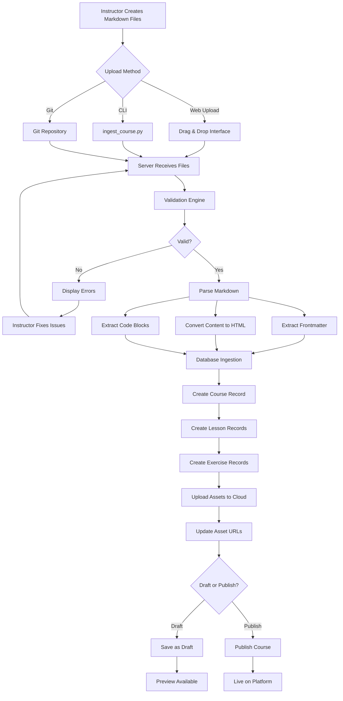
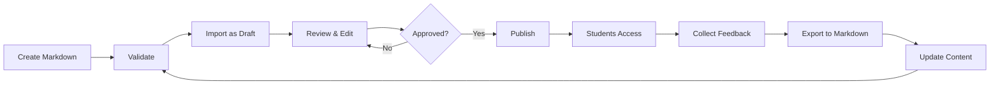
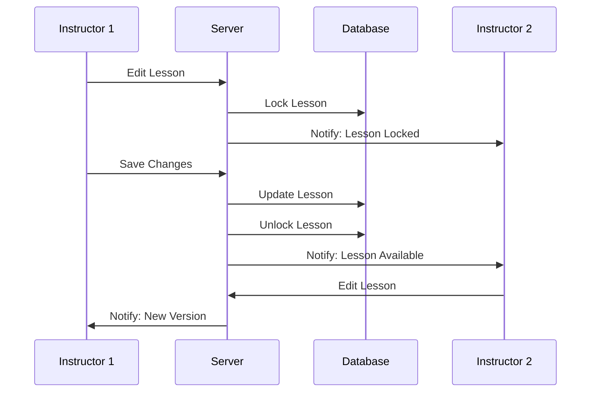

# Content Creator System - Markdown-Based Course Authoring Platform

## 🎯 Project Overview

**Vision**: Transform content creation from database-driven forms to file-based markdown authoring, enabling instructors to write courses in their favorite text editors and automatically ingest them into the platform.

**Current Pain Points**:
- ❌ Manual course creation through admin forms is time-consuming
- ❌ No version control for course content
- ❌ Difficult to collaborate on content development
- ❌ No offline editing capability
- ❌ Images and code snippets require separate upload/management
- ❌ Content preview requires database insertion

**Solution**: Markdown-First Content Management System
- ✅ Write courses in markdown files (like documentation)
- ✅ Git-friendly version control
- ✅ Automatic parsing and ingestion to database
- ✅ Embedded code examples with syntax highlighting
- ✅ Image references with automatic upload
- ✅ Preview before publishing
- ✅ Bulk import/export capabilities
- ✅ Collaborative editing workflow

---

## �‍🏫 Instructor Content Creation Workflow

### Overview: Multiple Creation Methods

Instructors have **three flexible ways** to create and manage course content, depending on their technical expertise and preferences:

#### **Method 1: Web-Based Instructor Dashboard** 🌐 (Non-Technical Friendly)
Perfect for instructors who prefer a visual interface without dealing with markdown files directly.

**Access**: Log in → Navigate to `/instructor/dashboard`

**Features**:
- **Visual Course Builder**: Create courses through web forms (similar to WordPress/Medium)
- **Built-in Markdown Editor**: Split-screen editor with live preview
- **Drag-and-Drop Asset Upload**: Upload images/videos directly from browser
- **Course Management Panel**: View all your courses, edit metadata, publish/unpublish
- **Progress Analytics**: See student engagement and completion rates
- **Course Templates**: Start from pre-built templates (Python Beginner, SQL Fundamentals, etc.)

**Typical Workflow**:
```
1. Click "Create New Course" button
2. Fill in course details (title, description, price, difficulty)
3. Add lessons using built-in editor:
   - Type markdown in left panel
   - See rendered preview in right panel
   - Insert code blocks with syntax highlighting
4. Upload images/videos via drag-and-drop
5. Add exercises with test cases
6. Click "Save as Draft" → Review → "Publish"
```

**Who uses this**: Instructors who prefer point-and-click interfaces, non-developers, instructors creating single courses.

---

#### **Method 2: Markdown Files + CLI Upload** 💻 (Developer Friendly)
Perfect for technical instructors who want full control and prefer working in their favorite code editor (VS Code, Sublime, Vim).

**Setup**: Install CLI tool once:
```bash
pip install -r requirements.txt
python ingest_course.py --help
```

**Workflow**:
```bash
# 1. Create markdown files locally
mkdir -p content/courses/python-fundamentals/lessons
mkdir -p content/courses/python-fundamentals/exercises
mkdir -p content/courses/python-fundamentals/assets/images

# 2. Write course content in your editor (VS Code, Vim, etc.)
code content/courses/python-fundamentals/course.md
code content/courses/python-fundamentals/lessons/01-introduction.md
code content/courses/python-fundamentals/exercises/01-hello-world.md

# 3. Validate before uploading
python ingest_course.py validate content/courses/python-fundamentals/

# 4. Import as draft (safe mode)
python ingest_course.py import content/courses/python-fundamentals/ --draft --progress

# 5. Review on website
# Visit: https://yoursite.com/instructor/courses/python-fundamentals/preview

# 6. Publish when ready
python ingest_course.py publish python-fundamentals --course-id=123
```

**Who uses this**: Technical instructors, developers, instructors managing multiple courses, teams who want version control.

---

#### **Method 3: Git Repository Integration** 🔄 (Advanced/Team Collaboration)
Perfect for teams of instructors collaborating on course content with full version control.

**Setup**: Connect your Git repository (GitHub/GitLab) to the platform:
```bash
# 1. Create a course repository
git clone git@github.com:yourorg/python-fundamentals-course.git
cd python-fundamentals-course

# 2. Use course template
python ingest_course.py create-template python --output=.

# 3. Edit content locally
code lessons/01-introduction.md

# 4. Commit and push
git add .
git commit -m "Add introduction lesson"
git push origin main

# 5. Platform auto-syncs (if webhook configured)
# OR manually trigger sync in dashboard
```

**Advanced Features**:
- **Branch-based editing**: Create `draft` branch, merge to `main` to publish
- **Pull request workflow**: Review changes before publishing
- **Collaboration**: Multiple instructors working on same course
- **Version history**: Rollback to previous versions anytime
- **CI/CD integration**: Auto-validate on commit

**Who uses this**: Development teams, organizations with multiple instructors, courses requiring technical review.

---

### Instructor Dashboard Features (Phase 3)

When instructors log in to `/instructor/dashboard`, they see:

```
┌─────────────────────────────────────────────────────┐
│ 👨‍🏫 Instructor Dashboard - John Doe                 │
├─────────────────────────────────────────────────────┤
│                                                     │
│ 📊 Overview                                         │
│ ┌────────┬────────┬────────┬────────┐             │
│ │ Courses│ Lessons│Students│ Revenue│             │
│ │   5    │   45   │  230   │ $4,500 │             │
│ └────────┴────────┴────────┴────────┘             │
│                                                     │
│ 📚 Your Courses              [+ Create New Course] │
│ ┌─────────────────────────────────────────────┐   │
│ │ Python Fundamentals                         │   │
│ │ Published • 230 students • 4.8⭐            │   │
│ │ [Edit] [Analytics] [Preview] [Unpublish]    │   │
│ ├─────────────────────────────────────────────┤   │
│ │ SQL Mastery                                 │   │
│ │ Draft • 0 students                          │   │
│ │ [Edit] [Publish] [Preview] [Delete]         │   │
│ └─────────────────────────────────────────────┘   │
│                                                     │
│ 🎯 Quick Actions                                    │
│ • [Create Course from Template]                    │
│ • [Upload Markdown Bundle (.zip)]                  │
│ • [Import from Git Repository]                     │
│ • [View Student Feedback]                          │
│ • [Download Course as Markdown]                    │
└─────────────────────────────────────────────────────┘
```

**Navigation**:
- `/instructor/dashboard` - Overview and course list
- `/instructor/courses/create` - Create new course (web form or upload)
- `/instructor/courses/{id}/edit` - Edit existing course
- `/instructor/courses/{id}/lessons` - Manage lessons
- `/instructor/courses/{id}/exercises` - Manage exercises
- `/instructor/analytics` - Course performance analytics
- `/instructor/settings` - Profile and preferences
- `/instructor/help` - Documentation and tutorials

---

### Content Creation Experience: Web Editor

When creating content via the web interface, instructors use a **split-screen markdown editor**:

```
┌─────────────────────────────────────────────────────┐
│ ✏️ Edit Lesson: Introduction to Python              │
├────────────────────┬────────────────────────────────┤
│ 📝 Markdown Editor │ 👁️ Live Preview               │
│                    │                                │
│ ---                │ Introduction to Python         │
│ title: Intro       │ ─────────────────────────      │
│ duration: 30       │ Welcome to Python!             │
│ ---                │                                │
│                    │ What is Python?                │
│ # Introduction     │ Python is a high-level...      │
│                    │                                │
│ Welcome!           │ print("Hello, World!")         │
│                    │                                │
│ ## What is Python? │                                │
│ Python is...       │                                │
│                    │                                │
│ ```python          │                                │
│ print("Hello!")    │                                │
│ ```                │                                │
│                    │                                │
│   │ [Python Logo Image]            │
├────────────────────┴────────────────────────────────┤
│ [Upload Image] [Insert Code] [Add Video Link]      │
│ [Save Draft]  [Preview Course]  [Publish]  [Back]  │
└─────────────────────────────────────────────────────┘
```

**Editor Features**:
- **Syntax highlighting** for markdown
- **Auto-save** every 30 seconds
- **Undo/Redo** support
- **Code block templates** (Python, SQL, JavaScript, etc.)
- **Image upload widget** with preview
- **Video link insertion** (YouTube, Vimeo)
- **Keyboard shortcuts** (Ctrl+B for bold, Ctrl+K for code, etc.)
- **Dark/Light theme** toggle
- **Distraction-free mode** (full-screen editing)
- **Mobile responsive** (edit on tablet/phone)

---

### Access Control & Permissions

**Role-Based Access**:
```python
# Instructors can only:
- View their own courses (filter by instructor_id)
- Edit their own courses
- Publish/unpublish their own courses
- View analytics for their courses
- Cannot access other instructors' content
- Cannot access admin panel

# Admins can:
- View all courses
- Edit any course
- Delete courses
- Manage instructors
- View platform-wide analytics
- Access admin panel at /admin
```

**Implementation** (Flask blueprint with decorators):
```python
from flask import Blueprint, abort
from flask_login import login_required, current_user

instructor_bp = Blueprint('instructor', __name__, url_prefix='/instructor')

@instructor_bp.route('/courses/<int:course_id>/edit')
@login_required
def edit_course(course_id):
    course = Tutorial.query.get_or_404(course_id)
    
    # Check permission
    if course.instructor_id != current_user.id and not current_user.is_admin:
        abort(403)  # Forbidden
    
    return render_template('instructor/edit_course.html', course=course)
```

---

### Registration & Onboarding

**Becoming an Instructor**:

1. **Sign up** as regular user at `/auth/register`
2. **Request instructor access** at `/account/become-instructor`
3. **Admin approves** the request (or auto-approved based on criteria)
4. **Role updated** to `instructor`
5. **Welcome email** with getting started guide
6. **Onboarding tutorial** (interactive walkthrough of dashboard)
7. **First course creation** (guided step-by-step)

**Instructor Application Form**:
```
Name: ___________
Email: ___________
Teaching Experience: [Text area]
Sample Course Outline: [Text area or file upload]
LinkedIn/Portfolio: ___________
Why teach on our platform: [Text area]

[Submit Application]
```

---

### Comparison: Admin Panel vs Instructor Dashboard

| Feature | Admin Panel | Instructor Dashboard |
|---------|-------------|---------------------|
| **Access** | `/admin` | `/instructor` |
| **View All Courses** | ✅ Yes | ❌ No (only own) |
| **Create Course** | ✅ Yes | ✅ Yes |
| **Edit Any Course** | ✅ Yes | ❌ No (only own) |
| **Delete Courses** | ✅ Yes | ✅ Own courses only |
| **Manage Users** | ✅ Yes | ❌ No |
| **Platform Analytics** | ✅ Yes | ❌ No |
| **Course Analytics** | ✅ All courses | ✅ Own courses |
| **Revenue Reports** | ✅ Platform total | ✅ Own earnings |
| **Approve Instructors** | ✅ Yes | ❌ No |
| **Configure Platform** | ✅ Yes | ❌ No |

**Key Difference**: 
- **Admin = Platform Management** (oversee everything)
- **Instructor = Content Creation** (create and manage own courses)

---

## �📊 System Architecture Overview

```
┌─────────────────────────────────────────────────────────────────┐
│                    CONTENT CREATOR WORKFLOW                      │
└─────────────────────────────────────────────────────────────────┘

    Instructor/Author                    Platform System
    ─────────────────                    ───────────────

    📝 Write Course in                   🔄 Ingestion Engine
       Markdown Files                       ├─ Parser (Frontmatter + Content)
       ├─ course.md                         ├─ Validator (Schema Check)
       ├─ lesson_01.md                      ├─ Asset Handler (Images/Videos)
       ├─ lesson_02.md                      └─ Database Inserter
       ├─ exercises/                               ↓
       │  ├─ ex_01.md                      💾 Database
       │  └─ ex_02.md                         ├─ Tutorials
       └─ assets/                             ├─ Lessons
          └─ images/                          └─ Exercises
                                                    ↓
    🚀 Upload/Commit                       🌐 Frontend Display
       ├─ Git Push                           ├─ Course Catalog
       ├─ Web Upload                         ├─ Lesson Viewer
       └─ API Submit                         └─ Exercise Player
              ↓                                     ↓
    ✅ Auto-Ingestion                      👨‍🎓 Student Learning
       ├─ Parse Metadata
       ├─ Create Course
       ├─ Create Lessons
       └─ Create Exercises
```

---

## 🗂️ Markdown File Structure

### Standard Course Bundle Structure

```
content/
├── courses/
│   └── python-fundamentals/
│       ├── course.md                    # Course metadata
│       ├── README.md                    # Instructor notes (optional)
│       ├── lessons/
│       │   ├── 01-introduction.md
│       │   ├── 02-variables.md
│       │   ├── 03-data-types.md
│       │   ├── 04-operators.md
│       │   └── ...
│       ├── exercises/
│       │   ├── 01-hello-world.md
│       │   ├── 02-variables-practice.md
│       │   ├── 03-calculator.md
│       │   └── ...
│       ├── quizzes/                     # Optional
│       │   ├── 01-basics-quiz.md
│       │   └── 02-variables-quiz.md
│       └── assets/
│           ├── images/
│           │   ├── python-logo.png
│           │   ├── variable-diagram.jpg
│           │   └── ...
│           └── videos/                  # Video file references
│               └── intro-video.mp4
```

---

## 📝 Markdown File Format Specifications

### 1. Course Metadata File (`course.md`)

```markdown
---
# Course Frontmatter (YAML)
course_id: python-fundamentals
title: Python Programming Fundamentals
slug: python-programming-fundamentals
course_type: python
category: programming
difficulty_level: beginner
instructor_email: byambaa1982@gmail.com
price: 49.99
is_free: false
is_featured: true
estimated_duration_hours: 20
status: draft
tags:
  - python
  - programming
  - beginner
  - fundamentals
thumbnail: assets/images/course-thumbnail.png
preview_video: assets/videos/preview.mp4
---

# Python Programming Fundamentals

## Short Description
Master Python programming from scratch with hands-on exercises and real-world projects.

## Full Description

Welcome to **Python Programming Fundamentals**! This comprehensive course is designed for complete beginners who want to learn Python programming from the ground up.

### What You'll Learn
- Python syntax and basic programming concepts
- Variables, data types, and operators
- Control flow (if statements, loops)
- Functions and modules
- Object-oriented programming basics
- File handling and error management
- Working with popular Python libraries

### Prerequisites
- No programming experience required
- A computer with internet access
- Desire to learn coding

### Course Structure
- 10 detailed lessons with video explanations
- 30+ hands-on coding exercises
- Quizzes to test your understanding
- Final project: Build a real-world application

### Who This Course Is For
- Complete beginners to programming
- Students learning Python for school/university
- Career switchers entering tech
- Hobbyists wanting to automate tasks
```

---

### 2. Lesson File Format (`lessons/01-introduction.md`)

```markdown
---
# Lesson Frontmatter
lesson_id: introduction-to-python
title: Introduction to Python Programming
slug: introduction-to-python
section_name: Getting Started
order_index: 1
content_type: text
estimated_duration_minutes: 30
is_free_preview: true
video_url: https://youtube.com/watch?v=xyz
video_duration_seconds: 1200
---

# Introduction to Python Programming

Welcome to your first lesson! In this lesson, you'll learn what Python is and why it's one of the most popular programming languages in the world.

## What is Python?

Python is a **high-level, interpreted programming language** known for its:
- 🎯 Simple, readable syntax
- 🚀 Versatility (web, data science, automation, AI)
- 📚 Extensive library ecosystem
- 👥 Large, supportive community


## Why Learn Python?

### 1. Beginner-Friendly
Python's syntax reads like English, making it perfect for beginners:

```python
# This is Python code - notice how readable it is!
print("Hello, World!")
name = "Alice"
print(f"Welcome, {name}!")
```

### 2. Versatile Applications
Python is used in:
- **Web Development**: Django, Flask
- **Data Science**: Pandas, NumPy, Matplotlib
- **Machine Learning**: TensorFlow, PyTorch, Scikit-learn
- **Automation**: Scripting, task automation
- **Game Development**: Pygame

### 3. High Demand
Python developers are in high demand with competitive salaries.

## Installing Python

### Windows
1. Visit [python.org](https://www.python.org/downloads/)
2. Download Python 3.11+ installer
3. Run installer and check "Add Python to PATH"
4. Verify installation:
```bash
python --version
```

### macOS
```bash
# Using Homebrew
brew install python3
```

### Linux
```bash
# Ubuntu/Debian
sudo apt update
sudo apt install python3 python3-pip
```

## Your First Python Program

Let's write the traditional "Hello, World!" program:

```python
print("Hello, World!")
```

**What's happening?**
- `print()` is a built-in function that displays text
- The text inside quotes is called a "string"
- Python executes this code line by line

## Key Takeaways

✅ Python is a beginner-friendly, versatile programming language  
✅ It's used in web development, data science, AI, and automation  
✅ Python syntax is readable and resembles natural language  
✅ You've written your first Python program!

## Next Steps

In the next lesson, we'll dive into **Variables and Data Types**, where you'll learn how to store and manipulate data in Python.

---

**Practice Exercise**: Try modifying the "Hello, World!" program to print your name!
```

---

### 3. Exercise File Format (`exercises/01-hello-world.md`)

```markdown
---
# Exercise Frontmatter
exercise_id: hello-world
title: Hello World - Your First Python Program
slug: hello-world-python
lesson_id: introduction-to-python
exercise_type: python
difficulty: easy
order_index: 1
points: 10
estimated_time_minutes: 5
tags:
  - basics
  - print
  - syntax
---

# Hello World - Your First Python Program

## 🎯 Objective
Write a Python program that prints "Hello, World!" to the console.

## 📖 Description

In programming, the "Hello, World!" program is a traditional first exercise. It helps you verify that your programming environment is set up correctly and introduces you to basic syntax.

Your task is simple: make Python print the text `Hello, World!` to the screen.

## 💡 Hints

<details>
<summary>Hint 1: Python Function</summary>

Python has a built-in function called `print()` that displays text on the screen.
</details>

<details>
<summary>Hint 2: String Syntax</summary>

Text in Python must be surrounded by quotes: `"text here"` or `'text here'`
</details>

<details>
<summary>Hint 3: Complete Example</summary>

```python
print("Hello, World!")
```
</details>

## 🧪 Test Cases

```yaml
test_cases:
  - name: "Prints Hello, World!"
    type: output
    expected: "Hello, World!"
    points: 10
    
  - name: "Uses print function"
    type: code_check
    pattern: "print\\("
    points: 5
```

## 🎨 Starter Code

```python
# Write your code below this line
# TODO: Print "Hello, World!" to the console


```

## ✅ Solution

```python
# Solution: Hello World
print("Hello, World!")
```

**Explanation**:
- `print()` is a function that displays output
- The text `"Hello, World!"` is a string (text data)
- When you run this code, you'll see `Hello, World!` printed to the console

## 🚀 Challenge Extension

Once you've completed the basic exercise, try these variations:

1. Print your own name instead of "World"
2. Print multiple lines using multiple `print()` statements
3. Use `\n` to add a new line within a single print statement

```python
# Example of printing multiple lines
print("Hello, World!")
print("Welcome to Python programming!")
print("This is\na multi-line\noutput!")
```

## 📚 Related Concepts
- Functions in Python
- String data type
- Console output
```

---

### 4. Quiz File Format (`quizzes/01-basics-quiz.md`) [Optional]

```markdown
---
quiz_id: python-basics-quiz
title: Python Basics - Knowledge Check
lesson_id: introduction-to-python
order_index: 1
passing_score: 70
time_limit_minutes: 10
---

# Python Basics Quiz

Test your understanding of Python fundamentals!

## Question 1
**What is Python?**

- [ ] A type of snake
- [x] A high-level programming language
- [ ] A web browser
- [ ] An operating system

*Explanation*: Python is a high-level, interpreted programming language known for its readability.

---

## Question 2
**Which function is used to display output in Python?**

- [ ] display()
- [ ] console.log()
- [x] print()
- [ ] echo()

*Explanation*: The `print()` function is used to output text to the console in Python.

---

## Question 3
**Python is a compiled language. True or False?**

- [ ] True
- [x] False

*Explanation*: Python is an interpreted language, not a compiled one. Code is executed line by line.

---

## Question 4 (Multiple Choice)
**Which of the following are valid Python data types? (Select all that apply)**

- [x] int (integers)
- [x] str (strings)
- [x] float (floating-point numbers)
- [ ] char (characters)

*Explanation*: Python has int, str, and float as built-in data types. There's no separate 'char' type (characters are just single-character strings).
```

---

## 🔧 Technical Components

### Component 1: Markdown Parser & Validator

**Purpose**: Parse markdown files and validate against schema

**Key Features**:
- YAML frontmatter parsing
- Markdown content extraction
- Schema validation (required fields, data types)
- Code block extraction and highlighting
- Image path resolution
- Asset reference validation

**Technology**: Python libraries
- `python-frontmatter==1.0.1` - Parse YAML frontmatter
- `mistune==3.0.2` - Fast markdown parser with better security than markdown2
- `Pygments==2.17.2` - Syntax highlighting for code blocks
- `pydantic==2.5.0` - Schema validation with type hints (v2 for better performance)
- `PyYAML==6.0.1` - YAML processing with safe_load
- `typing-extensions==4.9.0` - Enhanced type hints for Python 3.8+
- `asyncio` - Async/await support for concurrent processing

---

### Component 2: Asset Management System

**Purpose**: Handle images, videos, and other media files

**Features**:
- Automatic asset detection from markdown
- Image optimization (resize, compress)
- Cloud upload (AWS S3 / Azure Blob)
- CDN integration
- Local caching
- Duplicate detection

**Technology Stack**:
- `Pillow==10.1.0` - Image processing and optimization
- `pillow-avif-plugin==1.3.1` - Modern AVIF format support
- `boto3==1.34.0` - AWS S3 integration
- `python-magic==0.4.27` - File type detection (security)
- `hashlib` (stdlib) - Content-based hashing for deduplication

**Workflow**:
```python
# Async asset processing pipeline
1. Scan markdown for asset references (regex + AST parsing)
2. Validate asset files exist and check MIME types (security)
3. Calculate content hash (SHA-256) for deduplication
4. Optimize images:
   - Convert to WebP/AVIF
   - Generate responsive sizes (thumbnail, medium, large)
   - Strip EXIF data (privacy)
   - Compress with quality=85
5. Upload to cloud storage (async batch upload)
6. Generate CDN URLs with cache-busting
7. Update database with asset URLs (transaction)
8. Clean up temporary files
```

---

### Component 3: Ingestion Engine

**Purpose**: Transform markdown content into database records

**Process Flow**:
```
📁 Markdown Bundle
    ↓
🔍 Validation
    ├─ Schema check
    ├─ Required fields
    ├─ Asset existence
    └─ Duplicate detection
    ↓
🔄 Transformation
    ├─ Parse frontmatter
    ├─ Convert markdown to HTML
    ├─ Extract test cases
    ├─ Process code blocks
    └─ Resolve asset URLs
    ↓
💾 Database Insertion
    ├─ Create/Update Tutorial
    ├─ Create/Update Lessons
    ├─ Create/Update Exercises
    └─ Link relationships
    ↓
✅ Confirmation & Preview
```

---

### Component 4: Web Interface

**Purpose**: Provide UI for content creators to upload and manage content

**Features**:
- Drag-and-drop file upload
- Folder structure upload (zip file)
- Git repository integration
- Preview before publish
- Validation error display
- Bulk operations
- Version history

---

### Component 5: CLI Tool

**Purpose**: Command-line tool for developers/instructors

**Technology**: `click==8.1.7` - Better than argparse for complex CLIs

**Commands**:
```bash
# Validate markdown without publishing (with verbose output)
python ingest_course.py validate python-fundamentals/ --verbose

# Ingest course (draft mode with progress bar)
python ingest_course.py import python-fundamentals/ --draft --progress

# Publish course (with dry-run option)
python ingest_course.py publish python-fundamentals --course-id=123 --dry-run

# Export existing course to markdown
python ingest_course.py export --course-id=123 --output=python-fundamentals/ --format=zip

# Watch mode (auto-ingest on file changes with debounce)
python ingest_course.py watch python-fundamentals/ --draft --debounce=2

# Batch operations with parallel processing
python ingest_course.py batch-import content/courses/ --workers=4 --draft

# Validate all courses in directory
python ingest_course.py validate-all content/courses/ --json-report=validation_report.json
```

**CLI Features**:
- Rich terminal output with colors and progress bars (`rich==13.7.0`)
- Structured logging with log levels
- JSON output for CI/CD integration
- Exit codes for automation (0=success, 1=validation error, 2=runtime error)
- Auto-completion support (bash/zsh)

---

## 📅 Implementation Phases

---

## **PHASE 1: Foundation & Parser Development** (Week 1-2)

### 🎯 Goals
- Create markdown parsing infrastructure
- Establish file format standards
- Build validation system
- Create sample course in markdown

### 📋 Deliverables
✅ Markdown parser library  
✅ Schema validation system  
✅ Sample course bundle (Python Fundamentals - 3 lessons)  
✅ Documentation for markdown format  
✅ Unit tests for parser  

### 🔨 Technical Tasks

#### 1.1 Markdown Parser Development
- [ ] Install and configure parsing libraries (`python-frontmatter`, `mistune>=3.0`)
- [ ] Create `app/content_parser/` module with `__init__.py` exports
- [ ] Build frontmatter extractor with type hints:
  ```python
  from typing import Dict, Any, Optional
  from pathlib import Path
  
  def extract_frontmatter(file_path: Path) -> tuple[Dict[str, Any], str]:
      """Extract YAML frontmatter and content from markdown."""
  ```
- [ ] Build markdown-to-HTML converter with sanitization (use `bleach==6.1.0`)
- [ ] Implement code block extraction with language detection (AST-based)
- [ ] Create image path resolver with URL validation (`validators==0.22.0`)
- [ ] Add metadata validator with Pydantic v2 models
- [ ] Implement parser plugin system for extensibility
- [ ] Add caching layer for parsed content (use `functools.lru_cache`)
- [ ] Create comprehensive error types:
  ```python
  class ParserError(Exception):
      """Base exception for parser errors."""
  
  class InvalidFrontmatterError(ParserError):
      """Raised when YAML frontmatter is invalid."""
  
  class MissingRequiredFieldError(ParserError):
      """Raised when required field is missing."""
  ```

#### 1.2 Schema Definition (Pydantic v2)
- [ ] Define course schema with validators:
  ```python
  from pydantic import BaseModel, Field, EmailStr, HttpUrl, validator
  from typing import Literal, Optional
  from decimal import Decimal
  from datetime import datetime
  
  class CourseSchema(BaseModel):
      course_id: str = Field(..., min_length=3, max_length=100, pattern=r'^[a-z0-9-]+$')
      title: str = Field(..., min_length=5, max_length=200)
      slug: str = Field(..., pattern=r'^[a-z0-9-]+$')
      course_type: Literal['python', 'sql', 'general']
      difficulty_level: Literal['beginner', 'intermediate', 'advanced']
      instructor_email: EmailStr
      price: Decimal = Field(ge=0, max_digits=10, decimal_places=2)
      is_free: bool = False
      status: Literal['draft', 'published', 'archived'] = 'draft'
      tags: list[str] = Field(default_factory=list, max_length=10)
      thumbnail: Optional[HttpUrl | Path] = None
      
      @validator('price')
      def validate_free_price(cls, v, values):
          if values.get('is_free') and v > 0:
              raise ValueError('Free courses must have price=0')
          return v
      
      model_config = {"frozen": False, "validate_assignment": True}
  ```
- [ ] Define lesson schema with content type union
- [ ] Define exercise schema with test case validation
- [ ] Define test case format (JSON Schema + Pydantic)
- [ ] Create schema documentation (auto-generate from Pydantic models)
- [ ] Add schema versioning for backward compatibility
- [ ] Implement schema migration utilities

#### 1.3 Sample Content Creation
- [ ] Write `course.md` for Python Fundamentals
- [ ] Write 3 sample lessons in markdown
- [ ] Write 5 sample exercises in markdown
- [ ] Gather/create sample images
- [ ] Document markdown syntax guide

#### 1.4 Validation System
- [ ] Build schema validator with detailed error messages:
  ```python
  from typing import List
  from dataclasses import dataclass
  
  @dataclass
  class ValidationError:
      field: str
      message: str
      severity: Literal['error', 'warning', 'info']
      line_number: Optional[int] = None
      file_path: Optional[Path] = None
  
  class Validator:
      def validate(self, data: Dict) -> List[ValidationError]:
          """Validate and return list of errors."""
  ```
- [ ] Create asset existence checker (check before upload)
- [ ] Implement duplicate detection (hash-based + slug-based)
- [ ] Add error reporting system with context (show surrounding lines)
- [ ] Create validation report generator (HTML + JSON + Terminal)
- [ ] Add custom validation rules engine
- [ ] Implement validation caching (skip re-validation if unchanged)
- [ ] Add spell-checking for content (`pyspellchecker==0.7.2`)
- [ ] Implement link validation (check broken URLs) using `aiohttp`
- [ ] Add accessibility validation (alt text, heading structure)

### 📁 New Files Created
```
app/
├── content_parser/
│   ├── __init__.py              # Public API exports
│   ├── markdown_parser.py       # Main parser (200-300 LOC)
│   ├── frontmatter.py           # YAML frontmatter handler
│   ├── html_renderer.py         # Markdown to HTML with sanitization
│   ├── code_extractor.py        # Extract and syntax highlight code blocks
│   ├── validators.py            # Schema validation logic
│   ├── schemas.py               # Pydantic v2 schemas with validators
│   ├── exceptions.py            # Custom exception hierarchy
│   ├── utils.py                 # Helper functions (slug, path resolution)
│   ├── plugins/                 # Parser extension system
│   │   ├── __init__.py
│   │   ├── mermaid.py          # Mermaid diagram support
│   │   └── latex.py            # LaTeX math support
│   └── tests/                   # Unit tests (collocated)
│       ├── __init__.py
│       ├── test_parser.py
│       ├── test_validators.py
│       └── fixtures/            # Test markdown files
├── content_ingestion/           # Placeholder for Phase 2
│   └── __init__.py
└── content_export/              # Placeholder for Phase 3
    └── __init__.py

content/
└── courses/
    └── python-fundamentals/     # Sample course
        ├── course.md
        ├── lessons/
        │   ├── 01-introduction.md
        │   ├── 02-variables.md
        │   └── 03-operators.md
        ├── exercises/
        │   ├── 01-hello-world.md
        │   ├── 02-variable-practice.md
        │   ├── 03-calculator.md
        │   ├── 04-data-types.md
        │   └── 05-operators.md
        └── assets/
            └── images/

markdown/
└── CONTENT_FORMAT_GUIDE.md      # Markdown syntax reference
```

### 🧪 Testing (TDD Approach)
- [ ] Unit tests for parser (95%+ coverage target):
  ```python
  # Use pytest with fixtures
  import pytest
  from pathlib import Path
  
  @pytest.fixture
  def sample_course_md(tmp_path):
      """Create temporary markdown file for testing."""
      course_file = tmp_path / "course.md"
      course_file.write_text("""---
title: Test Course
---
# Content""")
      return course_file
  
  def test_parser_extracts_frontmatter(sample_course_md):
      metadata, content = parse_markdown(sample_course_md)
      assert metadata['title'] == 'Test Course'
      assert '# Content' in content
  ```
- [ ] Validation test cases (property-based testing with `hypothesis==6.92.0`):
  ```python
  from hypothesis import given, strategies as st
  
  @given(st.text(min_size=1, max_size=100))
  def test_slug_generation_always_valid(title):
      slug = generate_slug(title)
      assert slug.islower()
      assert re.match(r'^[a-z0-9-]+$', slug)
  ```
- [ ] Sample markdown parsing test with real course examples
- [ ] Error handling tests (test all exception types)
- [ ] Edge case tests:
  - Empty frontmatter
  - Malformed YAML
  - Missing required fields
  - Unicode characters in content
  - Large files (>10MB)
  - Deeply nested structures
- [ ] Performance tests (use `pytest-benchmark`):
  ```python
  def test_parser_performance(benchmark):
      result = benchmark(parse_markdown, large_course_file)
      assert benchmark.stats['mean'] < 0.1  # <100ms
  ```
- [ ] Integration tests with actual database
- [ ] Snapshot tests for HTML output (use `pytest-snapshot`)

### ✅ Success Criteria
- Parser successfully extracts frontmatter and content
- Validation catches all required field errors
- Sample course passes validation
- Documentation is clear and comprehensive
- All tests pass

---

## **PHASE 2: Ingestion Engine & Database Integration** (Week 3-4)

### 🎯 Goals
- Build automated ingestion system
- Database insertion logic
- Asset upload handling
- CLI tool for ingestion

### 📋 Deliverables
✅ Working ingestion engine  
✅ Asset management system  
✅ CLI tool (`ingest_course.py`)  
✅ Database integration  
✅ Duplicate handling  

### 🔨 Technical Tasks

#### 2.1 Ingestion Engine Core
- [ ] Create `app/content_ingestion/engine.py` with async support:
  ```python
  from typing import Protocol
  from contextlib import asynccontextmanager
  
  class IngestionEngine:
      """Main ingestion orchestrator with transaction support."""
      
      async def ingest_course_bundle(self, path: Path, draft: bool = True) -> CourseResult:
          async with self.transaction() as tx:
              try:
                  # Parse markdown files (parallel)
                  course_data = await self.parse_course(path)
                  lessons_data = await self.parse_lessons(path / 'lessons')
                  exercises_data = await self.parse_exercises(path / 'exercises')
                  
                  # Validate all data
                  await self.validate_all(course_data, lessons_data, exercises_data)
                  
                  # Upload assets (parallel batch upload)
                  asset_urls = await self.upload_assets(path / 'assets')
                  
                  # Insert into database (preserve order)
                  course_id = await self.create_course(course_data, tx)
                  await self.create_lessons(lessons_data, course_id, tx)
                  await self.create_exercises(exercises_data, course_id, tx)
                  
                  await tx.commit()
                  return CourseResult(success=True, course_id=course_id)
              except Exception as e:
                  await tx.rollback()
                  logger.error(f"Ingestion failed: {e}", exc_info=True)
                  raise IngestionError(f"Failed to ingest course") from e
  ```
- [ ] Build course ingestion logic with upsert support
- [ ] Build lesson ingestion logic with ordering validation
- [ ] Build exercise ingestion logic with test case parsing
- [ ] Implement transaction management using SQLAlchemy SAVEPOINT
- [ ] Add progress tracking with callbacks:
  ```python
  from typing import Callable
  
  ProgressCallback = Callable[[str, int, int], None]
  
  def ingest_with_progress(path: Path, callback: ProgressCallback):
      total_items = count_markdown_files(path)
      for idx, file in enumerate(markdown_files, 1):
          process_file(file)
          callback(f"Processing {file.name}", idx, total_items)
  ```
- [ ] Add structured logging with context:
  ```python
  import structlog
  
  logger = structlog.get_logger()
  logger.info("course.ingestion.started", 
              course_id=course_id, 
              file_count=len(files),
              instructor_id=instructor.id)
  ```
- [ ] Implement retry logic for transient failures (use `tenacity==8.2.3`)
- [ ] Add dry-run mode (validate without persisting)

#### 2.2 Database Integration
- [ ] Create instructor lookup with caching:
  ```python
  from functools import lru_cache
  from sqlalchemy.orm import Session
  
  @lru_cache(maxsize=128)
  def get_instructor_by_email(email: str, db: Session) -> Optional[User]:
      return db.query(User).filter_by(email=email, role='instructor').first()
  ```
- [ ] Implement course creation/update with merge:
  ```python
  def upsert_course(course_data: CourseSchema, db: Session) -> Tutorial:
      existing = db.query(Tutorial).filter_by(slug=course_data.slug).first()
      if existing:
          # Update existing
          for key, value in course_data.model_dump(exclude_unset=True).items():
              setattr(existing, key, value)
          existing.updated_at = datetime.utcnow()
          course = existing
      else:
          # Create new
          course = Tutorial(**course_data.model_dump())
          db.add(course)
      db.flush()  # Get ID without committing
      return course
  ```
- [ ] Handle lesson relationships with bulk insert:
  ```python
  from sqlalchemy import insert
  
  # Bulk insert for performance
  db.execute(insert(Lesson), lesson_records)
  ```
- [ ] Handle exercise relationships with cascade delete
- [ ] Add duplicate detection (by slug and content hash)
- [ ] Implement upsert logic with conflict resolution strategy
- [ ] Use database connection pooling (SQLAlchemy pool settings)
- [ ] Implement database health checks before ingestion
- [ ] Add query logging for debugging (SQLAlchemy echo=True in dev)
- [ ] Use database indexes for faster lookups (check existing indexes)

#### 2.3 Asset Management
- [ ] Create `app/assets/manager.py` with async S3 upload:
  ```python
  import aioboto3
  from pathlib import Path
  from typing import AsyncIterator
  
  class AssetManager:
      def __init__(self, s3_bucket: str, cdn_domain: str):
          self.s3_bucket = s3_bucket
          self.cdn_domain = cdn_domain
      
      async def upload_assets_batch(self, assets: list[Path]) -> dict[Path, str]:
          """Upload multiple assets in parallel and return URLs."""
          session = aioboto3.Session()
          async with session.client('s3') as s3:
              tasks = [self._upload_single(s3, asset) for asset in assets]
              results = await asyncio.gather(*tasks, return_exceptions=True)
              return dict(zip(assets, results))
      
      async def _upload_single(self, s3, asset: Path) -> str:
          # Validate file type (security)
          if not self._is_safe_file(asset):
              raise SecurityError(f"Unsafe file type: {asset.suffix}")
          
          # Generate content-based key (deduplication)
          content_hash = self._hash_file(asset)
          key = f"assets/{content_hash[:2]}/{content_hash}{asset.suffix}"
          
          # Check if already exists (skip upload)
          if await self._exists_in_s3(s3, key):
              return self._generate_cdn_url(key)
          
          # Upload with metadata
          await s3.upload_file(
              str(asset),
              self.s3_bucket,
              key,
              ExtraArgs={
                  'ContentType': self._get_mime_type(asset),
                  'CacheControl': 'max-age=31536000',  # 1 year
                  'ACL': 'private'  # Use CloudFront signed URLs
              }
          )
          return self._generate_cdn_url(key)
  ```
- [ ] Implement image optimizer with responsive sizes:
  ```python
  from PIL import Image
  
  def optimize_image(image_path: Path, output_dir: Path) -> dict[str, Path]:
      """Generate multiple sizes: thumbnail (150px), medium (800px), large (1200px)."""
      img = Image.open(image_path)
      
      # Strip EXIF for privacy
      img = Image.new(img.mode, img.size)
      
      sizes = {
          'thumbnail': 150,
          'medium': 800,
          'large': 1200,
      }
      
      outputs = {}
      for size_name, width in sizes.items():
          # Resize maintaining aspect ratio
          resized = img.copy()
          resized.thumbnail((width, width * 2), Image.Resampling.LANCZOS)
          
          # Save as WebP with quality=85
          output_path = output_dir / f"{image_path.stem}_{size_name}.webp"
          resized.save(output_path, 'WebP', quality=85, method=6)
          outputs[size_name] = output_path
      
      return outputs
  ```
- [ ] Add cloud upload (AWS S3 with aioboto3 for async)
- [ ] Generate unique asset IDs (UUID v4 + timestamp)
- [ ] Update markdown references to uploaded URLs (regex replacement)
- [ ] Add asset cleanup (delete orphaned files after 30 days)
- [ ] Implement asset versioning (keep old versions for rollback)
- [ ] Add virus scanning for uploads (`clamd` integration)
- [ ] Implement rate limiting for uploads (prevent abuse)
- [ ] Add asset usage tracking (reference counting)

#### 2.4 CLI Tool Development (Click Framework)
- [ ] Create `ingest_course.py` with Click groups:
  ```python
  import click
  from rich.console import Console
  from rich.progress import Progress
  
  console = Console()
  
  @click.group()
  @click.version_option(version='1.0.0')
  @click.option('--verbose', '-v', count=True, help='Increase verbosity')
  @click.pass_context
  def cli(ctx, verbose):
      """Content ingestion CLI for markdown courses."""
      ctx.ensure_object(dict)
      ctx.obj['VERBOSE'] = verbose
      setup_logging(verbose)
  
  @cli.command()
  @click.argument('course_path', type=click.Path(exists=True, path_type=Path))
  @click.option('--strict/--no-strict', default=True, help='Fail on warnings')
  @click.option('--output', '-o', type=click.File('w'), help='JSON report output')
  @click.pass_context
  def validate(ctx, course_path: Path, strict: bool, output):
      """Validate markdown course structure and content."""
      try:
          with console.status("[bold green]Validating course..."):
              errors = validator.validate_course(course_path)
          
          if errors:
              console.print("[bold red]Validation failed:[/bold red]")
              for error in errors:
                  console.print(f"  • {error.field}: {error.message}", style="red")
              
              if output:
                  json.dump([e.__dict__ for e in errors], output, indent=2)
              
              sys.exit(1 if strict else 0)
          else:
              console.print("[bold green]✓ Validation passed![/bold green]")
      except Exception as e:
          console.print(f"[bold red]Error:[/bold red] {e}")
          if ctx.obj['VERBOSE'] > 0:
              console.print_exception()
          sys.exit(2)
  ```
- [ ] Implement `validate` command with JSON/HTML output
- [ ] Implement `import` command with rollback on error
- [ ] Implement `publish` command with confirmation prompt
- [ ] Add `--draft` flag support (default=True for safety)
- [ ] Add progress indicators with `rich.progress` (better than tqdm):
  ```python
  with Progress() as progress:
      task = progress.add_task("[cyan]Uploading assets...", total=len(assets))
      for asset in assets:
          upload_asset(asset)
          progress.update(task, advance=1)
  ```
- [ ] Create detailed error reporting with context:
  ```python
  console.print(Panel(
      f"[red]Error in file: {file_path}[/red]\n"
      f"Line {line_num}: {error_msg}\n\n"
      f"Context:\n{context_lines}",
      title="Validation Error",
      border_style="red"
  ))
  ```
- [ ] Add shell completion generation (`click.completion`)
- [ ] Implement `--dry-run` mode for all commands
- [ ] Add configuration file support (`~/.ingest_course.toml`)
- [ ] Implement logging to file with rotation

#### 2.5 Test Case Parsing
- [ ] Extract test cases from exercise markdown
- [ ] Store test cases as JSON in database
- [ ] Validate test case format
- [ ] Support multiple test case types (output, code_check)

### 📁 New Files Created
```
app/
├── content_ingestion/
│   ├── __init__.py
│   ├── engine.py                # Main ingestion engine
│   ├── course_ingester.py       # Course-specific logic
│   ├── lesson_ingester.py       # Lesson-specific logic
│   ├── exercise_ingester.py     # Exercise-specific logic
│   └── transaction.py           # Transaction management
├── assets/
│   ├── __init__.py
│   ├── manager.py               # Asset management
│   ├── optimizer.py             # Image optimization
│   └── uploader.py              # Cloud upload logic

ingest_course.py                 # CLI tool (root directory)

tests/
└── ingestion/
    ├── test_engine.py
    ├── test_parser.py
    └── test_assets.py
```

### 🔄 Workflow Example
```bash
# Step 1: Validate markdown structure
python ingest_course.py validate content/courses/python-fundamentals/

# Step 2: Import as draft
python ingest_course.py import content/courses/python-fundamentals/ --draft

# Step 3: Review on website (draft mode)
# Visit: http://localhost:5000/catalog/course/python-programming-fundamentals

# Step 4: Publish
python ingest_course.py publish python-programming-fundamentals
```

### ✅ Success Criteria
- CLI tool ingests sample course without errors
- Course appears in database with correct relationships
- Assets are uploaded and URLs are correct
- Draft mode works (status='draft')
- Validation errors are clear and actionable
- Duplicate courses are handled gracefully

---

## **PHASE 3: Web Interface for Content Upload** (Week 5-6)

### 🎯 Goals
- Create instructor dashboard
- Build web-based course upload interface
- Implement preview functionality
- Add course management UI

### 📋 Deliverables
✅ Instructor dashboard  
✅ Course upload interface  
✅ Markdown preview  
✅ Asset upload UI  
✅ Course management panel  

### 🔨 Technical Tasks

#### 3.1 Instructor Dashboard
- [ ] Create `/instructor` blueprint
- [ ] Build dashboard home page (`/instructor/dashboard`)
- [ ] Display instructor's courses
- [ ] Show course statistics (enrollments, completion)
- [ ] Add quick actions (create, edit, view)

#### 3.2 Course Upload Interface
- [ ] Create `/instructor/courses/create` page
- [ ] Build drag-and-drop file uploader
- [ ] Support folder structure upload (zip)
- [ ] Display upload progress
- [ ] Validate files on upload
- [ ] Show validation errors in UI

#### 3.3 Markdown Editor & Preview
- [ ] Integrate markdown editor (SimpleMDE or Quill)
- [ ] Add split-screen preview (markdown → rendered HTML)
- [ ] Syntax highlighting for code blocks
- [ ] Live preview updates
- [ ] Mobile-responsive editor

#### 3.4 Course Management UI
- [ ] List instructor's courses (`/instructor/courses`)
- [ ] Edit course metadata inline
- [ ] Edit individual lessons
- [ ] Edit individual exercises
- [ ] Delete courses/lessons/exercises
- [ ] Publish/unpublish toggle

#### 3.5 Asset Upload UI
- [ ] Image upload widget
- [ ] Video upload (or link to external)
- [ ] Asset library (reusable assets)
- [ ] Asset preview
- [ ] Delete unused assets

### 📁 New Files Created
```
app/
├── instructor/                   # New blueprint
│   ├── __init__.py
│   ├── routes.py                # Dashboard, upload, management
│   ├── forms.py                 # Upload forms
│   └── utils.py

app/templates/
└── instructor/
    ├── base_instructor.html     # Instructor base template
    ├── dashboard.html
    ├── courses/
    │   ├── list.html
    │   ├── upload.html          # Upload interface
    │   ├── edit_markdown.html   # Markdown editor
    │   └── preview.html         # Course preview
    └── assets/
        └── library.html         # Asset management

app/static/
├── js/
│   ├── markdown-editor.js       # Editor integration
│   ├── file-uploader.js         # Drag-and-drop
│   └── preview.js               # Live preview
└── css/
    └── instructor.css           # Instructor UI styles
```

### 🎨 UI Features

**Dashboard**:
```
┌─────────────────────────────────────────────────────┐
│ 👨‍🏫 Instructor Dashboard - John Doe                 │
├─────────────────────────────────────────────────────┤
│                                                     │
│ 📊 Overview                                         │
│ ┌────────┬────────┬────────┬────────┐             │
│ │ Courses│ Lessons│Students│ Revenue│             │
│ │   5    │   45   │  230   │ $4,500 │             │
│ └────────┴────────┴────────┴────────┘             │
│                                                     │
│ 📚 Your Courses              [+ Create New Course] │
│ ┌─────────────────────────────────────────────┐   │
│ │ Python Fundamentals        Published  ✏️ 🗑️ │   │
│ │ 10 lessons • 230 students • 4.8⭐           │   │
│ ├─────────────────────────────────────────────┤   │
│ │ SQL Mastery               Draft      ✏️ 🗑️ │   │
│ │ 5 lessons • 0 students                      │   │
│ └─────────────────────────────────────────────┘   │
└─────────────────────────────────────────────────────┘
```

**Upload Interface**:
```
┌─────────────────────────────────────────────────────┐
│ 📤 Upload New Course                                │
├─────────────────────────────────────────────────────┤
│                                                     │
│ Method 1: Upload Markdown Bundle                   │
│ ┌────────────────────────────────────────────────┐│
│ │  📁 Drag & Drop Files or Folder Here           ││
│ │     or click to browse                         ││
│ │                                                ││
│ │  Accepted formats:                             ││
│ │  • .zip (course bundle)                        ││
│ │  • .md files + assets folder                   ││
│ └────────────────────────────────────────────────┘│
│                                                     │
│ Method 2: Create in Editor                         │
│ [Open Markdown Editor]                             │
│                                                     │
│ Method 3: Import from Git                          │
│ Git Repository URL: ___________________________    │
│                     [Import]                       │
└─────────────────────────────────────────────────────┘
```

**Markdown Editor**:
```
┌─────────────────────────────────────────────────────┐
│ ✏️ Edit Lesson: Introduction to Python              │
├────────────────────┬────────────────────────────────┤
│ # Markdown Editor  │ 🔍 Live Preview               │
│                    │                                │
│ ---                │ Introduction to Python         │
│ title: Intro       │ ─────────────────────────      │
│ ---                │ Welcome to Python!             │
│                    │                                │
│ # Introduction     │ What is Python?                │
│                    │ Python is a high-level...      │
│ Welcome!           │                                │
│                    │ print("Hello, World!")         │
│ ## What is Python? │                                │
│ Python is...       │                                │
│                    │                                │
│ ```python          │                                │
│ print("Hello!")    │                                │
│ ```                │                                │
├────────────────────┴────────────────────────────────┤
│ [Save Draft]  [Preview]  [Publish]  [Cancel]       │
└─────────────────────────────────────────────────────┘
```

### 🔐 Access Control
- [ ] Add `@instructor_required` decorator
- [ ] Allow instructors to see only their courses
- [ ] Admin can see all courses
- [ ] Instructor registration flow

### ✅ Success Criteria
- Instructors can upload markdown bundles via web
- Live preview shows rendered course correctly
- Validation errors display clearly in UI
- Course management UI is intuitive
- Mobile-responsive design works

---

## **PHASE 4: Export & Version Control** (Week 7)

### 🎯 Goals
- Export existing courses to markdown
- Version control integration
- Backup and restore
- Template generation

### 📋 Deliverables
✅ Export functionality (database → markdown)  
✅ Git integration  
✅ Course templates  
✅ Backup/restore system  

### 🔨 Technical Tasks

#### 4.1 Export Engine
- [ ] Create `app/content_export/exporter.py`
- [ ] Build course-to-markdown converter
- [ ] Build lesson-to-markdown converter
- [ ] Build exercise-to-markdown converter
- [ ] Download assets and organize in folder
- [ ] Generate `course.md` with frontmatter

#### 4.2 CLI Export Command
- [ ] Implement `export` command in `ingest_course.py`
- [ ] Support single course export
- [ ] Support bulk export (all courses)
- [ ] Create zip file option
- [ ] Add metadata export (JSON)

#### 4.3 Git Integration
- [ ] Create Git repository per course (optional)
- [ ] Auto-commit on course updates
- [ ] Push to remote repository (GitHub/GitLab)
- [ ] Support branch-based editing (draft branches)
- [ ] Pull request workflow for course updates

#### 4.4 Course Templates
- [ ] Create course starter templates
  - Python course template
  - SQL course template
  - General programming template
- [ ] Generate template via CLI
- [ ] Include sample lessons and exercises
- [ ] Add comprehensive documentation

#### 4.5 Backup System
- [ ] Scheduled export to cloud storage
- [ ] Incremental backups
- [ ] Restore from backup UI
- [ ] Version history tracking

### 📁 New Files Created
```
app/
└── content_export/
    ├── __init__.py
    ├── exporter.py              # Main export engine
    ├── markdown_generator.py    # Generate markdown from DB
    └── git_integration.py       # Git operations

templates/
└── course_templates/
    ├── python_template/
    │   ├── course.md
    │   ├── lessons/
    │   └── exercises/
    ├── sql_template/
    └── general_template/

ingest_course.py                 # Updated with export commands
```

### 🔄 Export Workflow
```bash
# Export single course to markdown
python ingest_course.py export --course-id=123 --output=python-fundamentals/

# Export all courses
python ingest_course.py export-all --output=content/courses/

# Create course template
python ingest_course.py create-template python --title="My Python Course"

# Backup to cloud
python ingest_course.py backup --destination=s3://backup-bucket/
```

### ✅ Success Criteria
- Export produces valid markdown files
- Exported course can be re-imported without errors
- Git integration works for version control
- Templates help instructors start quickly
- Backup system runs automatically

---

## **PHASE 5: Advanced Features & Polish** (Week 8-9)

### 🎯 Goals
- Collaborative editing
- Bulk operations
- Advanced validation
- Performance optimization
- Analytics for instructors

### 📋 Deliverables
✅ Collaborative editing system  
✅ Bulk import/export tools  
✅ Advanced markdown features  
✅ Performance optimizations  
✅ Instructor analytics dashboard  

### 🔨 Technical Tasks

#### 5.1 Collaborative Editing
- [ ] Multi-user editing with conflict resolution
- [ ] Real-time collaboration (WebSockets)
- [ ] Comment system for reviewers
- [ ] Approval workflow (draft → review → published)
- [ ] Instructor team management

#### 5.2 Bulk Operations
- [ ] Bulk course import (multiple courses at once)
- [ ] Bulk exercise creation
- [ ] CSV import for metadata
- [ ] Template-based bulk creation
- [ ] Batch validation

#### 5.3 Advanced Markdown Features
- [ ] Interactive code widgets (embedded REPL)
- [ ] Mermaid diagram support
- [ ] LaTeX math equation support
- [ ] Embedded quizzes in lessons
- [ ] Video timestamps and chapters
- [ ] Collapsible sections

#### 5.4 Enhanced Validation
- [ ] Code execution validation (test starter code)
- [ ] Plagiarism detection (compare with existing)
- [ ] Readability score (Flesch-Kincaid)
- [ ] SEO optimization suggestions
- [ ] Accessibility checks (alt text, contrast)

#### 5.5 Instructor Analytics
- [ ] Course performance dashboard
- [ ] Student engagement metrics
- [ ] Exercise completion rates
- [ ] Drop-off analysis
- [ ] Revenue tracking per course
- [ ] Content effectiveness scoring

#### 5.6 Performance Optimization
- [ ] Cache rendered markdown with Redis:
  ```python
  from flask_caching import Cache
  from functools import wraps
  
  cache = Cache(config={'CACHE_TYPE': 'RedisCache', 'CACHE_REDIS_URL': REDIS_URL})
  
  @cache.memoize(timeout=3600)  # 1 hour
  def render_markdown(lesson_id: int) -> str:
      lesson = Lesson.query.get(lesson_id)
      return mistune.html(lesson.content)
  
  # Invalidate on update
  def update_lesson(lesson_id: int, content: str):
      lesson = Lesson.query.get(lesson_id)
      lesson.content = content
      db.session.commit()
      cache.delete_memoized(render_markdown, lesson_id)
  ```
- [ ] Lazy loading for large courses (pagination + infinite scroll)
- [ ] Background processing with Celery:
  ```python
  from celery import Celery
  
  celery = Celery('content_ingestion', broker=REDIS_URL)
  
  @celery.task(bind=True, max_retries=3)
  def ingest_course_async(self, course_path: str):
      try:
          engine = IngestionEngine()
          result = engine.ingest_course_bundle(Path(course_path))
          return {'success': True, 'course_id': result.course_id}
      except Exception as e:
          self.retry(exc=e, countdown=60)  # Retry after 1 minute
  ```
- [ ] Database query optimization:
  ```python
  # Bad: N+1 query problem
  courses = Tutorial.query.all()
  for course in courses:
      print(course.instructor.name)  # Each iteration queries DB
  
  # Good: Eager loading
  from sqlalchemy.orm import joinedload
  
  courses = Tutorial.query.options(joinedload(Tutorial.instructor)).all()
  for course in courses:
      print(course.instructor.name)  # No additional queries
  
  # Use select_in_load for collections (better than subqueryload)
  from sqlalchemy.orm import selectinload
  
  courses = Tutorial.query.options(
      selectinload(Tutorial.lessons).selectinload(Lesson.exercises)
  ).all()
  ```
- [ ] Asset CDN integration (CloudFront/CloudFlare)
- [ ] Database connection pooling:
  ```python
  SQLALCHEMY_ENGINE_OPTIONS = {
      'pool_size': 10,
      'pool_recycle': 3600,
      'pool_pre_ping': True,
      'max_overflow': 20
  }
  ```
- [ ] Implement database read replicas for queries
- [ ] Add APM monitoring (New Relic, DataDog, or Sentry Performance):
  ```python
  import sentry_sdk
  from sentry_sdk.integrations.flask import FlaskIntegration
  
  sentry_sdk.init(
      dsn=SENTRY_DSN,
      integrations=[FlaskIntegration()],
      traces_sample_rate=0.1,  # Sample 10% of transactions
      profiles_sample_rate=0.1,
  )
  ```
- [ ] Use database query profiling:
  ```python
  from flask_sqlalchemy import get_debug_queries
  
  @app.after_request
  def after_request(response):
      for query in get_debug_queries():
          if query.duration >= 0.1:  # Log slow queries (>100ms)
              logger.warning(f"Slow query ({query.duration}s): {query.statement}")
      return response
  ```
- [ ] Implement request/response compression (gzip)
- [ ] Add HTTP/2 support for faster asset loading
- [ ] Use database indexes on frequently queried columns:
  ```sql
  CREATE INDEX idx_tutorials_slug ON tutorials(slug);  -- Already exists
  CREATE INDEX idx_lessons_tutorial_order ON lessons(tutorial_id, order_index);
  CREATE INDEX idx_exercises_type ON exercises(exercise_type);
  ```

### 📁 New Features
```
app/
├── collaboration/
│   ├── __init__.py
│   ├── editor.py                # Collaborative editor
│   ├── comments.py              # Comment system
│   └── approval.py              # Approval workflow
├── analytics/
│   ├── __init__.py
│   ├── instructor_analytics.py  # Course analytics
│   └── engagement.py            # Student engagement
└── advanced_validation/
    ├── __init__.py
    ├── code_validator.py
    ├── plagiarism.py
    └── accessibility.py

app/templates/
└── instructor/
    └── analytics/
        ├── dashboard.html
        ├── course_performance.html
        └── student_engagement.html
```

### 🎨 UI Enhancements

**Instructor Analytics Dashboard**:
```
┌─────────────────────────────────────────────────────┐
│ 📊 Course Analytics - Python Fundamentals           │
├─────────────────────────────────────────────────────┤
│                                                     │
│ 📈 30-Day Overview                                  │
│ ┌─────────────────────────────────────────────┐   │
│ │  Enrollments   Completions   Avg Progress   │   │
│ │      45            23            62%         │   │
│ └─────────────────────────────────────────────┘   │
│                                                     │
│ 📉 Drop-off Points                                  │
│ ├─ Lesson 3: Operators (35% drop-off) ⚠️          │
│ ├─ Exercise 7: Functions (20% drop-off)           │
│ └─ Lesson 8: OOP (15% drop-off)                   │
│                                                     │
│ ⏱️ Average Time Per Lesson                         │
│ ├─ Lesson 1: 25 min                               │
│ ├─ Lesson 2: 32 min                               │
│ └─ ...                                             │
│                                                     │
│ ⭐ Student Ratings                                  │
│ 4.7 / 5.0 (42 reviews)                             │
└─────────────────────────────────────────────────────┘
```

#### 5.7 Documentation & Training
- [ ] Comprehensive markdown format guide
- [ ] Video tutorials for instructors
- [ ] Best practices guide
- [ ] FAQ and troubleshooting
- [ ] Sample courses library

### ✅ Success Criteria
- Multiple instructors can collaborate on one course
- Bulk operations save significant time
- Advanced markdown features render correctly
- Analytics provide actionable insights
- System handles 100+ courses efficiently

---

## 📈 System Flow Diagrams

### Ingestion Flow



---

### Content Lifecycle



---

### Collaborative Editing Flow



---

## 🔐 Security Considerations

### Access Control
- **Role-Based Access (Flask-Principal or Flask-Security-Too)**:
  ```python
  from flask_principal import Permission, RoleNeed
  
  admin_permission = Permission(RoleNeed('admin'))
  instructor_permission = Permission(RoleNeed('instructor'))
  
  @app.route('/admin/courses')
  @admin_permission.require(http_exception=403)
  def admin_courses():
      pass
  ```
  - Admin: Full access to all courses
  - Instructor: Own courses only (filter by `instructor_id`)
  - Reviewer: Read + comment (no publish)
  - Student: Published content only (`status='published'`)

### Content Validation & XSS Prevention
- **HTML Sanitization**:
  ```python
  import bleach
  
  ALLOWED_TAGS = ['p', 'h1', 'h2', 'h3', 'code', 'pre', 'a', 'strong', 'em', 'ul', 'ol', 'li']
  ALLOWED_ATTRS = {'a': ['href', 'title'], 'code': ['class']}
  
  def sanitize_html(html: str) -> str:
      return bleach.clean(
          html,
          tags=ALLOWED_TAGS,
          attributes=ALLOWED_ATTRS,
          strip=True  # Remove disallowed tags
      )
  ```
- **Malicious Code Prevention**:
  - Sanitize HTML output with `bleach>=6.1.0`
  - Escape user input (Flask auto-escapes in Jinja2)
  - Validate file uploads (type, size, magic bytes):
    ```python
    import magic
    
    def validate_upload(file_path: Path) -> bool:
        # Check MIME type (not just extension)
        mime = magic.from_file(str(file_path), mime=True)
        allowed_types = ['image/jpeg', 'image/png', 'image/webp', 'video/mp4']
        
        if mime not in allowed_types:
            raise SecurityError(f"Invalid file type: {mime}")
        
        # Check file size
        if file_path.stat().st_size > 100 * 1024 * 1024:  # 100MB
            raise SecurityError("File too large")
        
        return True
    ```
  - Scan for malware (ClamAV integration):
    ```python
    import clamd
    
    cd = clamd.ClamdUnixSocket()
    result = cd.scan(str(file_path))
    if result[str(file_path)][0] == 'FOUND':
        raise SecurityError(f"Malware detected: {result}")
    ```
  - Use Content Security Policy (CSP) headers
  - Rate limit uploads (Flask-Limiter)

### Asset Security
- **Cloud Storage (S3)**:
  - Private S3 buckets (no public read)
  - Generate signed URLs with expiration:
    ```python
    import boto3
    from botocore.exceptions import ClientError
    
    s3 = boto3.client('s3')
    
    def generate_signed_url(key: str, expires_in: int = 3600) -> str:
        try:
            url = s3.generate_presigned_url(
                'get_object',
                Params={'Bucket': BUCKET_NAME, 'Key': key},
                ExpiresIn=expires_in
            )
            return url
        except ClientError as e:
            logger.error(f"Failed to generate signed URL: {e}")
            raise
    ```
  - CloudFront CDN with signed cookies
  - Enable S3 versioning (rollback capability)
  - Regular security audits (AWS Trusted Advisor)
  - Encrypt at rest (S3 SSE-KMS)
  - Enable S3 access logging

### Input Validation
- **YAML/JSON Injection Prevention**:
  ```python
  import yaml
  
  # Always use safe_load, never load()
  def parse_yaml_safe(content: str) -> dict:
      try:
          return yaml.safe_load(content)
      except yaml.YAMLError as e:
          raise ParserError(f"Invalid YAML: {e}")
  ```
- **Path Traversal Prevention**:
  ```python
  from pathlib import Path
  
  def safe_join(base: Path, *paths: str) -> Path:
      """Safely join paths, preventing directory traversal."""
      result = base.joinpath(*paths).resolve()
      if not result.is_relative_to(base.resolve()):
          raise SecurityError("Path traversal detected")
      return result
  ```

### Version Control & Audit
- **Audit Trail**:
  ```python
  class AuditLog(db.Model):
      id = db.Column(db.Integer, primary_key=True)
      user_id = db.Column(db.Integer, db.ForeignKey('users.id'))
      action = db.Column(db.String(50))  # create, update, delete, publish
      resource_type = db.Column(db.String(50))  # course, lesson, exercise
      resource_id = db.Column(db.Integer)
      old_values = db.Column(db.JSON)
      new_values = db.Column(db.JSON)
      ip_address = db.Column(db.String(45))
      user_agent = db.Column(db.String(255))
      created_at = db.Column(db.DateTime, default=datetime.utcnow)
  ```
  - Track all content changes (before/after diff)
  - Log user actions with IP and timestamp
  - Backup before destructive operations
  - Keep audit logs for 1 year (compliance)

### Dependency Security
- [ ] Use `pip-audit` to scan for vulnerable packages
- [ ] Pin dependencies with hashes in `requirements.txt`:
  ```
  mistune==3.0.2 --hash=sha256:...
  ```
- [ ] Regular dependency updates (Dependabot/Renovate)
- [ ] Use `safety` for security checks in CI/CD

---

## 📊 Success Metrics

### Phase 1 Success Metrics
- ✅ Parser handles 100% of sample courses without errors
- ✅ Validation catches all intentional errors in test files
- ✅ Documentation is clear (tested with 5 instructors)

### Phase 2 Success Metrics
- ✅ CLI tool ingests sample course in <10 seconds
- ✅ Zero data loss during ingestion
- ✅ 95%+ accuracy in markdown-to-database transformation

### Phase 3 Success Metrics
- ✅ Web upload works for files up to 100MB
- ✅ Preview renders in <2 seconds
- ✅ 90%+ instructor satisfaction score

### Phase 4 Success Metrics
- ✅ Export produces bit-perfect markdown (re-import = identical)
- ✅ Git integration works with GitHub/GitLab
- ✅ Backup runs daily without failures

### Phase 5 Success Metrics
- ✅ Collaborative editing handles 10+ concurrent users
- ✅ Bulk operations reduce manual work by 80%
- ✅ Analytics dashboard loads in <3 seconds
- ✅ Platform handles 500+ courses without performance degradation

---

## 🛠️ Technology Stack Summary

| Component | Technology | Purpose |
|-----------|-----------|---------|
| **Backend** | Flask | Web framework |
| **Database** | MySQL | Data storage |
| **Markdown Parser** | python-frontmatter, mistune | Parse markdown files |
| **Validation** | Pydantic | Schema validation |
| **HTML Conversion** | markdown2 / mistune | Markdown → HTML |
| **Syntax Highlighting** | Pygments | Code block highlighting |
| **Image Processing** | Pillow | Image optimization |
| **Cloud Storage** | AWS S3 / Azure Blob | Asset storage |
| **CLI** | Click / argparse | Command-line tool |
| **Web Editor** | SimpleMDE / Quill | Markdown editor |
| **File Upload** | Dropzone.js | Drag-and-drop |
| **Version Control** | GitPython | Git integration |
| **Background Jobs** | Celery | Async processing |
| **Caching** | Redis | Performance optimization |

---

## 📚 Dependencies

### Python Packages
```txt
# Existing (from requirements.txt)
Flask==3.0.0
Flask-SQLAlchemy==3.1.1
Flask-Login==0.6.3
Flask-WTF==1.2.1
Flask-Migrate==4.0.5
Flask-Limiter==3.5.0            # Rate limiting
Flask-Caching==2.1.0            # Caching layer

# New for Content System - Core
python-frontmatter==1.0.1       # Parse YAML frontmatter
mistune==3.0.2                  # Markdown parsing (faster, more secure than markdown2)
Pygments==2.17.2                # Syntax highlighting for code blocks
bleach==6.1.0                   # HTML sanitization (XSS prevention)
pydantic==2.5.0                 # Schema validation with v2 performance
PyYAML==6.0.1                   # YAML processing
typing-extensions==4.9.0        # Enhanced type hints

# New for Content System - CLI
click==8.1.7                    # CLI framework (better than argparse)
rich==13.7.0                    # Terminal output formatting (replaces tqdm)
structlog==24.1.0               # Structured logging

# New for Content System - Assets
Pillow==10.1.0                  # Image processing
pillow-avif-plugin==1.3.1       # AVIF format support
python-magic==0.4.27            # File type detection (security)
validators==0.22.0              # URL/email validation

# New for Content System - Cloud & Performance
boto3==1.34.0                   # AWS S3 integration
aioboto3==12.3.0                # Async S3 operations
aiohttp==3.9.1                  # Async HTTP client
aiofiles==23.2.1                # Async file I/O

# New for Content System - Git
GitPython==3.1.40               # Git integration

# New for Content System - Testing
pytest==7.4.3                   # Testing framework
pytest-asyncio==0.21.1          # Async test support
pytest-cov==4.1.0               # Coverage reporting
pytest-benchmark==4.0.0         # Performance testing
pytest-snapshot==0.9.0          # Snapshot testing
hypothesis==6.92.0              # Property-based testing

# New for Content System - Security
clamd==1.0.2                    # ClamAV integration (virus scanning)
Flask-Principal==0.4.0          # Permission management

# New for Content System - Code Quality
pip-audit==2.6.1                # Vulnerability scanning
safety==2.3.5                   # Dependency security checks
black==23.12.0                  # Code formatting
flake8==6.1.0                   # Linting
mypy==1.7.1                     # Static type checking

# New for Content System - Utilities
tenacity==8.2.3                 # Retry logic
pyspellchecker==0.7.2           # Spell checking
python-slugify==8.0.1           # URL-safe slug generation
```

---

## 📖 Documentation Deliverables

### For Instructors
1. **Markdown Format Guide** (`CONTENT_FORMAT_GUIDE.md`)
   - Complete syntax reference
   - Examples for every element
   - Best practices

2. **Quick Start Guide** (`INSTRUCTOR_QUICKSTART.md`)
   - 5-minute tutorial
   - Sample course creation
   - Common tasks

3. **Video Tutorials** (YouTube/Platform)
   - Creating your first course
   - Using the markdown editor
   - Publishing workflow

### For Developers
1. **API Documentation** (`API_REFERENCE.md`)
   - Ingestion API endpoints
   - Parser API
   - Export API

2. **Architecture Documentation** (`ARCHITECTURE.md`)
   - System design
   - Data flow
   - Security model

3. **Deployment Guide** (`DEPLOYMENT.md`)
   - Server setup
   - Environment variables
   - Scaling considerations

---

## 🎯 Final Outcome

After completing all 5 phases, instructors will be able to:

✅ **Write courses in markdown** using their favorite editor (VS Code, Sublime, etc.)  
✅ **Version control content** with Git (branch, merge, revert)  
✅ **Preview courses** before publishing  
✅ **Upload via web or CLI** (flexible workflow)  
✅ **Collaborate with other instructors** (review, comment, approve)  
✅ **Bulk import hundreds of exercises** (CSV or markdown)  
✅ **Export courses for backup** or offline editing  
✅ **Track course performance** with analytics  
✅ **Iterate quickly** on content based on student feedback  

### Key Benefits

| Before (Current System) | After (Markdown System) |
|------------------------|------------------------|
| Manual form filling | Write in markdown |
| No version control | Git-based workflow |
| Online-only editing | Offline editing |
| One-by-one creation | Bulk operations |
| No collaboration | Multi-instructor teams |
| Hard to backup | One-click export |
| Limited analytics | Comprehensive insights |
| Slow iteration | Fast updates |

---

## 🚀 Getting Started (Post-Implementation)

### For Instructors

**Step 1**: Get course template
```bash
python ingest_course.py create-template python --title="My Python Course"
```

**Step 2**: Edit markdown files in `content/courses/my-python-course/`

**Step 3**: Validate
```bash
python ingest_course.py validate content/courses/my-python-course/
```

**Step 4**: Import as draft
```bash
python ingest_course.py import content/courses/my-python-course/ --draft
```

**Step 5**: Preview at `http://yoursite.com/catalog/course/my-python-course`

**Step 6**: Publish
```bash
python ingest_course.py publish my-python-course
```

### For Administrators

**Monitor ingestion logs**:
```bash
tail -f logs/ingestion.log
```

**Backup all courses**:
```bash
python ingest_course.py backup --destination=s3://backup-bucket/
```

**Generate analytics report**:
```bash
python ingest_course.py analytics --output=reports/monthly.pdf
```

---

## 📞 Support & Resources

### Instructor Support
- **Documentation**: `/docs/markdown-guide`
- **Video Tutorials**: `/instructor/training`
- **Help Center**: `support@yourplatform.com`
- **Community Forum**: `https://community.yourplatform.com`

### Developer Resources
- **GitHub Repository**: `https://github.com/yourorg/tutorial-platform`
- **API Documentation**: `/api/docs`
- **Slack Channel**: `#content-system-dev`

---

## 🎉 Conclusion

This **Content Creator System** transforms course authoring from a database-centric, manual process into a developer-friendly, markdown-based workflow. By leveraging markdown files, Git version control, and automated ingestion, instructors can focus on creating high-quality content while the system handles the technical complexities.

**The result**: Faster course creation, better collaboration, and a scalable platform that grows with your content library.

---

**Document Version**: 1.0  
**Last Updated**: December 13, 2025  
**Status**: Planning Complete - Ready for Implementation
