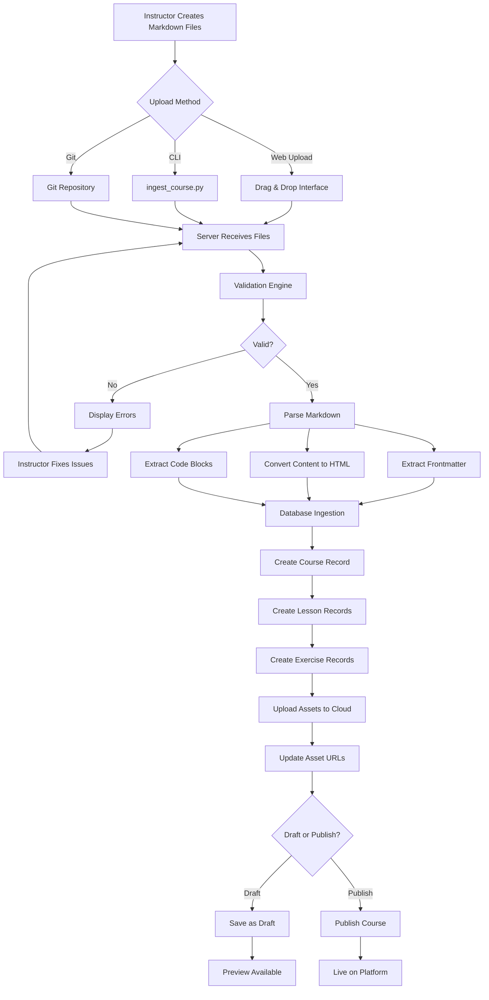
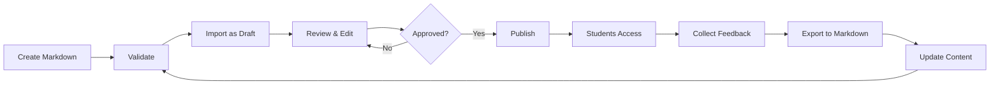
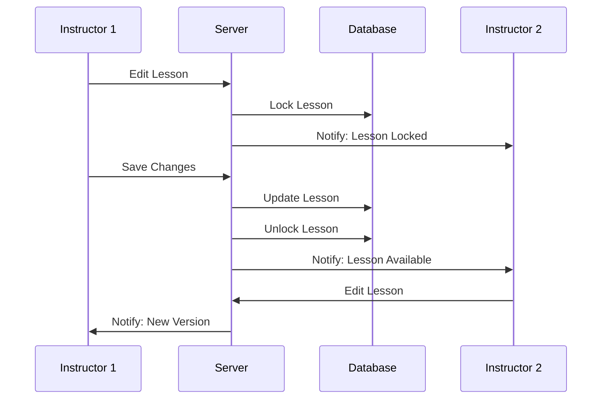

# Content Creator System - Markdown-Based Course Authoring Platform

## 🎯 Project Overview

**Vision**: Transform content creation from database-driven forms to file-based markdown authoring, enabling instructors to write courses in their favorite text editors and automatically ingest them into the platform.

**Current Pain Points**:
- ❌ Manual course creation through admin forms is time-consuming
- ❌ No version control for course content
- ❌ Difficult to collaborate on content development
- ❌ No offline editing capability
- ❌ Images and code snippets require separate upload/management
- ❌ Content preview requires database insertion

**Solution**: Markdown-First Content Management System
- ✅ Write courses in markdown files (like documentation)
- ✅ Git-friendly version control
- ✅ Automatic parsing and ingestion to database
- ✅ Embedded code examples with syntax highlighting
- ✅ Image references with automatic upload
- ✅ Preview before publishing
- ✅ Bulk import/export capabilities
- ✅ Collaborative editing workflow

---

## 📊 System Architecture Overview

```
┌─────────────────────────────────────────────────────────────────┐
│                    CONTENT CREATOR WORKFLOW                      │
└─────────────────────────────────────────────────────────────────┘

    Instructor/Author                    Platform System
    ─────────────────                    ───────────────

    📝 Write Course in                   🔄 Ingestion Engine
       Markdown Files                       ├─ Parser (Frontmatter + Content)
       ├─ course.md                         ├─ Validator (Schema Check)
       ├─ lesson_01.md                      ├─ Asset Handler (Images/Videos)
       ├─ lesson_02.md                      └─ Database Inserter
       ├─ exercises/                               ↓
       │  ├─ ex_01.md                      💾 Database
       │  └─ ex_02.md                         ├─ Tutorials
       └─ assets/                             ├─ Lessons
          └─ images/                          └─ Exercises
                                                    ↓
    🚀 Upload/Commit                       🌐 Frontend Display
       ├─ Git Push                           ├─ Course Catalog
       ├─ Web Upload                         ├─ Lesson Viewer
       └─ API Submit                         └─ Exercise Player
              ↓                                     ↓
    ✅ Auto-Ingestion                      👨‍🎓 Student Learning
       ├─ Parse Metadata
       ├─ Create Course
       ├─ Create Lessons
       └─ Create Exercises
```

---

## 🗂️ Markdown File Structure

### Standard Course Bundle Structure

```
content/
├── courses/
│   └── python-fundamentals/
│       ├── course.md                    # Course metadata
│       ├── README.md                    # Instructor notes (optional)
│       ├── lessons/
│       │   ├── 01-introduction.md
│       │   ├── 02-variables.md
│       │   ├── 03-data-types.md
│       │   ├── 04-operators.md
│       │   └── ...
│       ├── exercises/
│       │   ├── 01-hello-world.md
│       │   ├── 02-variables-practice.md
│       │   ├── 03-calculator.md
│       │   └── ...
│       ├── quizzes/                     # Optional
│       │   ├── 01-basics-quiz.md
│       │   └── 02-variables-quiz.md
│       └── assets/
│           ├── images/
│           │   ├── python-logo.png
│           │   ├── variable-diagram.jpg
│           │   └── ...
│           └── videos/                  # Video file references
│               └── intro-video.mp4
```

---

## 📝 Markdown File Format Specifications

### 1. Course Metadata File (`course.md`)

```markdown
---
# Course Frontmatter (YAML)
course_id: python-fundamentals
title: Python Programming Fundamentals
slug: python-programming-fundamentals
course_type: python
category: programming
difficulty_level: beginner
instructor_email: byambaa1982@gmail.com
price: 49.99
is_free: false
is_featured: true
estimated_duration_hours: 20
status: draft
tags:
  - python
  - programming
  - beginner
  - fundamentals
thumbnail: assets/images/course-thumbnail.png
preview_video: assets/videos/preview.mp4
---

# Python Programming Fundamentals

## Short Description
Master Python programming from scratch with hands-on exercises and real-world projects.

## Full Description

Welcome to **Python Programming Fundamentals**! This comprehensive course is designed for complete beginners who want to learn Python programming from the ground up.

### What You'll Learn
- Python syntax and basic programming concepts
- Variables, data types, and operators
- Control flow (if statements, loops)
- Functions and modules
- Object-oriented programming basics
- File handling and error management
- Working with popular Python libraries

### Prerequisites
- No programming experience required
- A computer with internet access
- Desire to learn coding

### Course Structure
- 10 detailed lessons with video explanations
- 30+ hands-on coding exercises
- Quizzes to test your understanding
- Final project: Build a real-world application

### Who This Course Is For
- Complete beginners to programming
- Students learning Python for school/university
- Career switchers entering tech
- Hobbyists wanting to automate tasks
```

---

### 2. Lesson File Format (`lessons/01-introduction.md`)

```markdown
---
# Lesson Frontmatter
lesson_id: introduction-to-python
title: Introduction to Python Programming
slug: introduction-to-python
section_name: Getting Started
order_index: 1
content_type: text
estimated_duration_minutes: 30
is_free_preview: true
video_url: https://youtube.com/watch?v=xyz
video_duration_seconds: 1200
---

# Introduction to Python Programming

Welcome to your first lesson! In this lesson, you'll learn what Python is and why it's one of the most popular programming languages in the world.

## What is Python?

Python is a **high-level, interpreted programming language** known for its:
- 🎯 Simple, readable syntax
- 🚀 Versatility (web, data science, automation, AI)
- 📚 Extensive library ecosystem
- 👥 Large, supportive community


## Why Learn Python?

### 1. Beginner-Friendly
Python's syntax reads like English, making it perfect for beginners:

```python
# This is Python code - notice how readable it is!
print("Hello, World!")
name = "Alice"
print(f"Welcome, {name}!")
```

### 2. Versatile Applications
Python is used in:
- **Web Development**: Django, Flask
- **Data Science**: Pandas, NumPy, Matplotlib
- **Machine Learning**: TensorFlow, PyTorch, Scikit-learn
- **Automation**: Scripting, task automation
- **Game Development**: Pygame

### 3. High Demand
Python developers are in high demand with competitive salaries.

## Installing Python

### Windows
1. Visit [python.org](https://www.python.org/downloads/)
2. Download Python 3.11+ installer
3. Run installer and check "Add Python to PATH"
4. Verify installation:
```bash
python --version
```

### macOS
```bash
# Using Homebrew
brew install python3
```

### Linux
```bash
# Ubuntu/Debian
sudo apt update
sudo apt install python3 python3-pip
```

## Your First Python Program

Let's write the traditional "Hello, World!" program:

```python
print("Hello, World!")
```

**What's happening?**
- `print()` is a built-in function that displays text
- The text inside quotes is called a "string"
- Python executes this code line by line

## Key Takeaways

✅ Python is a beginner-friendly, versatile programming language  
✅ It's used in web development, data science, AI, and automation  
✅ Python syntax is readable and resembles natural language  
✅ You've written your first Python program!

## Next Steps

In the next lesson, we'll dive into **Variables and Data Types**, where you'll learn how to store and manipulate data in Python.

---

**Practice Exercise**: Try modifying the "Hello, World!" program to print your name!
```

---

### 3. Exercise File Format (`exercises/01-hello-world.md`)

```markdown
---
# Exercise Frontmatter
exercise_id: hello-world
title: Hello World - Your First Python Program
slug: hello-world-python
lesson_id: introduction-to-python
exercise_type: python
difficulty: easy
order_index: 1
points: 10
estimated_time_minutes: 5
tags:
  - basics
  - print
  - syntax
---

# Hello World - Your First Python Program

## 🎯 Objective
Write a Python program that prints "Hello, World!" to the console.

## 📖 Description

In programming, the "Hello, World!" program is a traditional first exercise. It helps you verify that your programming environment is set up correctly and introduces you to basic syntax.

Your task is simple: make Python print the text `Hello, World!` to the screen.

## 💡 Hints

<details>
<summary>Hint 1: Python Function</summary>

Python has a built-in function called `print()` that displays text on the screen.
</details>

<details>
<summary>Hint 2: String Syntax</summary>

Text in Python must be surrounded by quotes: `"text here"` or `'text here'`
</details>

<details>
<summary>Hint 3: Complete Example</summary>

```python
print("Hello, World!")
```
</details>

## 🧪 Test Cases

```yaml
test_cases:
  - name: "Prints Hello, World!"
    type: output
    expected: "Hello, World!"
    points: 10
    
  - name: "Uses print function"
    type: code_check
    pattern: "print\\("
    points: 5
```

## 🎨 Starter Code

```python
# Write your code below this line
# TODO: Print "Hello, World!" to the console


```

## ✅ Solution

```python
# Solution: Hello World
print("Hello, World!")
```

**Explanation**:
- `print()` is a function that displays output
- The text `"Hello, World!"` is a string (text data)
- When you run this code, you'll see `Hello, World!` printed to the console

## 🚀 Challenge Extension

Once you've completed the basic exercise, try these variations:

1. Print your own name instead of "World"
2. Print multiple lines using multiple `print()` statements
3. Use `\n` to add a new line within a single print statement

```python
# Example of printing multiple lines
print("Hello, World!")
print("Welcome to Python programming!")
print("This is\na multi-line\noutput!")
```

## 📚 Related Concepts
- Functions in Python
- String data type
- Console output
```

---

### 4. Quiz File Format (`quizzes/01-basics-quiz.md`) [Optional]

```markdown
---
quiz_id: python-basics-quiz
title: Python Basics - Knowledge Check
lesson_id: introduction-to-python
order_index: 1
passing_score: 70
time_limit_minutes: 10
---

# Python Basics Quiz

Test your understanding of Python fundamentals!

## Question 1
**What is Python?**

- [ ] A type of snake
- [x] A high-level programming language
- [ ] A web browser
- [ ] An operating system

*Explanation*: Python is a high-level, interpreted programming language known for its readability.

---

## Question 2
**Which function is used to display output in Python?**

- [ ] display()
- [ ] console.log()
- [x] print()
- [ ] echo()

*Explanation*: The `print()` function is used to output text to the console in Python.

---

## Question 3
**Python is a compiled language. True or False?**

- [ ] True
- [x] False

*Explanation*: Python is an interpreted language, not a compiled one. Code is executed line by line.

---

## Question 4 (Multiple Choice)
**Which of the following are valid Python data types? (Select all that apply)**

- [x] int (integers)
- [x] str (strings)
- [x] float (floating-point numbers)
- [ ] char (characters)

*Explanation*: Python has int, str, and float as built-in data types. There's no separate 'char' type (characters are just single-character strings).
```

---

## 🔧 Technical Components

### Component 1: Markdown Parser & Validator

**Purpose**: Parse markdown files and validate against schema

**Key Features**:
- YAML frontmatter parsing
- Markdown content extraction
- Schema validation (required fields, data types)
- Code block extraction and highlighting
- Image path resolution
- Asset reference validation

**Technology**: Python libraries
- `python-frontmatter` - Parse YAML frontmatter
- `markdown2` or `mistune` - Convert markdown to HTML
- `Pygments` - Syntax highlighting for code blocks
- `pydantic` - Schema validation
- `PyYAML` - YAML processing

---

### Component 2: Asset Management System

**Purpose**: Handle images, videos, and other media files

**Features**:
- Automatic asset detection from markdown
- Image optimization (resize, compress)
- Cloud upload (AWS S3 / Azure Blob)
- CDN integration
- Local caching
- Duplicate detection

**Workflow**:
```
1. Scan markdown for asset references
2. Validate asset files exist
3. Optimize images (WebP conversion, resize)
4. Upload to cloud storage
5. Generate CDN URLs
6. Update database with asset URLs
```

---

### Component 3: Ingestion Engine

**Purpose**: Transform markdown content into database records

**Process Flow**:
```
📁 Markdown Bundle
    ↓
🔍 Validation
    ├─ Schema check
    ├─ Required fields
    ├─ Asset existence
    └─ Duplicate detection
    ↓
🔄 Transformation
    ├─ Parse frontmatter
    ├─ Convert markdown to HTML
    ├─ Extract test cases
    ├─ Process code blocks
    └─ Resolve asset URLs
    ↓
💾 Database Insertion
    ├─ Create/Update Tutorial
    ├─ Create/Update Lessons
    ├─ Create/Update Exercises
    └─ Link relationships
    ↓
✅ Confirmation & Preview
```

---

### Component 4: Web Interface

**Purpose**: Provide UI for content creators to upload and manage content

**Features**:
- Drag-and-drop file upload
- Folder structure upload (zip file)
- Git repository integration
- Preview before publish
- Validation error display
- Bulk operations
- Version history

---

### Component 5: CLI Tool

**Purpose**: Command-line tool for developers/instructors

**Commands**:
```bash
# Validate markdown without publishing
python ingest_course.py validate python-fundamentals/

# Ingest course (draft mode)
python ingest_course.py import python-fundamentals/ --draft

# Publish course
python ingest_course.py publish python-fundamentals --course-id=123

# Export existing course to markdown
python ingest_course.py export --course-id=123 --output=python-fundamentals/

# Watch mode (auto-ingest on file changes)
python ingest_course.py watch python-fundamentals/ --draft
```

---

## 📅 Implementation Phases

---

## **PHASE 1: Foundation & Parser Development** (Week 1-2)

### 🎯 Goals
- Create markdown parsing infrastructure
- Establish file format standards
- Build validation system
- Create sample course in markdown

### 📋 Deliverables
✅ Markdown parser library  
✅ Schema validation system  
✅ Sample course bundle (Python Fundamentals - 3 lessons)  
✅ Documentation for markdown format  
✅ Unit tests for parser  

### 🔨 Technical Tasks

#### 1.1 Markdown Parser Development
- [ ] Install and configure parsing libraries (`python-frontmatter`, `markdown2`)
- [ ] Create `app/content_parser/` module
- [ ] Build frontmatter extractor
- [ ] Build markdown-to-HTML converter
- [ ] Implement code block extraction with language detection
- [ ] Create image path resolver
- [ ] Add metadata validator

#### 1.2 Schema Definition
- [ ] Define course schema (Pydantic models)
- [ ] Define lesson schema
- [ ] Define exercise schema
- [ ] Define test case format
- [ ] Create schema documentation

#### 1.3 Sample Content Creation
- [ ] Write `course.md` for Python Fundamentals
- [ ] Write 3 sample lessons in markdown
- [ ] Write 5 sample exercises in markdown
- [ ] Gather/create sample images
- [ ] Document markdown syntax guide

#### 1.4 Validation System
- [ ] Build schema validator
- [ ] Create asset existence checker
- [ ] Implement duplicate detection
- [ ] Add error reporting system
- [ ] Create validation report generator

### 📁 New Files Created
```
app/
├── content_parser/
│   ├── __init__.py
│   ├── markdown_parser.py       # Main parser
│   ├── validators.py            # Schema validation
│   ├── schemas.py               # Pydantic schemas
│   └── utils.py                 # Helper functions
├── content_ingestion/           # Placeholder for Phase 2
│   └── __init__.py
└── content_export/              # Placeholder for Phase 3
    └── __init__.py

content/
└── courses/
    └── python-fundamentals/     # Sample course
        ├── course.md
        ├── lessons/
        │   ├── 01-introduction.md
        │   ├── 02-variables.md
        │   └── 03-operators.md
        ├── exercises/
        │   ├── 01-hello-world.md
        │   ├── 02-variable-practice.md
        │   ├── 03-calculator.md
        │   ├── 04-data-types.md
        │   └── 05-operators.md
        └── assets/
            └── images/

markdown/
└── CONTENT_FORMAT_GUIDE.md      # Markdown syntax reference
```

### 🧪 Testing
- [ ] Unit tests for parser (90%+ coverage)
- [ ] Validation test cases
- [ ] Sample markdown parsing test
- [ ] Error handling tests

### ✅ Success Criteria
- Parser successfully extracts frontmatter and content
- Validation catches all required field errors
- Sample course passes validation
- Documentation is clear and comprehensive
- All tests pass

---

## **PHASE 2: Ingestion Engine & Database Integration** (Week 3-4)

### 🎯 Goals
- Build automated ingestion system
- Database insertion logic
- Asset upload handling
- CLI tool for ingestion

### 📋 Deliverables
✅ Working ingestion engine  
✅ Asset management system  
✅ CLI tool (`ingest_course.py`)  
✅ Database integration  
✅ Duplicate handling  

### 🔨 Technical Tasks

#### 2.1 Ingestion Engine Core
- [ ] Create `app/content_ingestion/engine.py`
- [ ] Build course ingestion logic
- [ ] Build lesson ingestion logic
- [ ] Build exercise ingestion logic
- [ ] Implement transaction management (rollback on error)
- [ ] Add progress tracking/logging

#### 2.2 Database Integration
- [ ] Create instructor lookup/matching (by email)
- [ ] Implement course creation/update logic
- [ ] Handle lesson relationships
- [ ] Handle exercise relationships
- [ ] Add duplicate detection (by slug)
- [ ] Implement upsert logic (update if exists)

#### 2.3 Asset Management
- [ ] Create `app/assets/manager.py`
- [ ] Implement image optimizer (Pillow)
- [ ] Add cloud upload (AWS S3 or local storage)
- [ ] Generate unique asset IDs
- [ ] Update markdown references to uploaded URLs
- [ ] Add asset cleanup (orphaned files)

#### 2.4 CLI Tool Development
- [ ] Create `ingest_course.py` script
- [ ] Implement `validate` command
- [ ] Implement `import` command
- [ ] Implement `publish` command
- [ ] Add `--draft` flag support
- [ ] Add progress indicators (tqdm)
- [ ] Create detailed error reporting

#### 2.5 Test Case Parsing
- [ ] Extract test cases from exercise markdown
- [ ] Store test cases as JSON in database
- [ ] Validate test case format
- [ ] Support multiple test case types (output, code_check)

### 📁 New Files Created
```
app/
├── content_ingestion/
│   ├── __init__.py
│   ├── engine.py                # Main ingestion engine
│   ├── course_ingester.py       # Course-specific logic
│   ├── lesson_ingester.py       # Lesson-specific logic
│   ├── exercise_ingester.py     # Exercise-specific logic
│   └── transaction.py           # Transaction management
├── assets/
│   ├── __init__.py
│   ├── manager.py               # Asset management
│   ├── optimizer.py             # Image optimization
│   └── uploader.py              # Cloud upload logic

ingest_course.py                 # CLI tool (root directory)

tests/
└── ingestion/
    ├── test_engine.py
    ├── test_parser.py
    └── test_assets.py
```

### 🔄 Workflow Example
```bash
# Step 1: Validate markdown structure
python ingest_course.py validate content/courses/python-fundamentals/

# Step 2: Import as draft
python ingest_course.py import content/courses/python-fundamentals/ --draft

# Step 3: Review on website (draft mode)
# Visit: http://localhost:5000/catalog/course/python-programming-fundamentals

# Step 4: Publish
python ingest_course.py publish python-programming-fundamentals
```

### ✅ Success Criteria
- CLI tool ingests sample course without errors
- Course appears in database with correct relationships
- Assets are uploaded and URLs are correct
- Draft mode works (status='draft')
- Validation errors are clear and actionable
- Duplicate courses are handled gracefully

---

## **PHASE 3: Web Interface for Content Upload** (Week 5-6)

### 🎯 Goals
- Create instructor dashboard
- Build web-based course upload interface
- Implement preview functionality
- Add course management UI

### 📋 Deliverables
✅ Instructor dashboard  
✅ Course upload interface  
✅ Markdown preview  
✅ Asset upload UI  
✅ Course management panel  

### 🔨 Technical Tasks

#### 3.1 Instructor Dashboard
- [ ] Create `/instructor` blueprint
- [ ] Build dashboard home page (`/instructor/dashboard`)
- [ ] Display instructor's courses
- [ ] Show course statistics (enrollments, completion)
- [ ] Add quick actions (create, edit, view)

#### 3.2 Course Upload Interface
- [ ] Create `/instructor/courses/create` page
- [ ] Build drag-and-drop file uploader
- [ ] Support folder structure upload (zip)
- [ ] Display upload progress
- [ ] Validate files on upload
- [ ] Show validation errors in UI

#### 3.3 Markdown Editor & Preview
- [ ] Integrate markdown editor (SimpleMDE or Quill)
- [ ] Add split-screen preview (markdown → rendered HTML)
- [ ] Syntax highlighting for code blocks
- [ ] Live preview updates
- [ ] Mobile-responsive editor

#### 3.4 Course Management UI
- [ ] List instructor's courses (`/instructor/courses`)
- [ ] Edit course metadata inline
- [ ] Edit individual lessons
- [ ] Edit individual exercises
- [ ] Delete courses/lessons/exercises
- [ ] Publish/unpublish toggle

#### 3.5 Asset Upload UI
- [ ] Image upload widget
- [ ] Video upload (or link to external)
- [ ] Asset library (reusable assets)
- [ ] Asset preview
- [ ] Delete unused assets

### 📁 New Files Created
```
app/
├── instructor/                   # New blueprint
│   ├── __init__.py
│   ├── routes.py                # Dashboard, upload, management
│   ├── forms.py                 # Upload forms
│   └── utils.py

app/templates/
└── instructor/
    ├── base_instructor.html     # Instructor base template
    ├── dashboard.html
    ├── courses/
    │   ├── list.html
    │   ├── upload.html          # Upload interface
    │   ├── edit_markdown.html   # Markdown editor
    │   └── preview.html         # Course preview
    └── assets/
        └── library.html         # Asset management

app/static/
├── js/
│   ├── markdown-editor.js       # Editor integration
│   ├── file-uploader.js         # Drag-and-drop
│   └── preview.js               # Live preview
└── css/
    └── instructor.css           # Instructor UI styles
```

### 🎨 UI Features

**Dashboard**:
```
┌─────────────────────────────────────────────────────┐
│ 👨‍🏫 Instructor Dashboard - John Doe                 │
├─────────────────────────────────────────────────────┤
│                                                     │
│ 📊 Overview                                         │
│ ┌────────┬────────┬────────┬────────┐             │
│ │ Courses│ Lessons│Students│ Revenue│             │
│ │   5    │   45   │  230   │ $4,500 │             │
│ └────────┴────────┴────────┴────────┘             │
│                                                     │
│ 📚 Your Courses              [+ Create New Course] │
│ ┌─────────────────────────────────────────────┐   │
│ │ Python Fundamentals        Published  ✏️ 🗑️ │   │
│ │ 10 lessons • 230 students • 4.8⭐           │   │
│ ├─────────────────────────────────────────────┤   │
│ │ SQL Mastery               Draft      ✏️ 🗑️ │   │
│ │ 5 lessons • 0 students                      │   │
│ └─────────────────────────────────────────────┘   │
└─────────────────────────────────────────────────────┘
```

**Upload Interface**:
```
┌─────────────────────────────────────────────────────┐
│ 📤 Upload New Course                                │
├─────────────────────────────────────────────────────┤
│                                                     │
│ Method 1: Upload Markdown Bundle                   │
│ ┌────────────────────────────────────────────────┐│
│ │  📁 Drag & Drop Files or Folder Here           ││
│ │     or click to browse                         ││
│ │                                                ││
│ │  Accepted formats:                             ││
│ │  • .zip (course bundle)                        ││
│ │  • .md files + assets folder                   ││
│ └────────────────────────────────────────────────┘│
│                                                     │
│ Method 2: Create in Editor                         │
│ [Open Markdown Editor]                             │
│                                                     │
│ Method 3: Import from Git                          │
│ Git Repository URL: ___________________________    │
│                     [Import]                       │
└─────────────────────────────────────────────────────┘
```

**Markdown Editor**:
```
┌─────────────────────────────────────────────────────┐
│ ✏️ Edit Lesson: Introduction to Python              │
├────────────────────┬────────────────────────────────┤
│ # Markdown Editor  │ 🔍 Live Preview               │
│                    │                                │
│ ---                │ Introduction to Python         │
│ title: Intro       │ ─────────────────────────      │
│ ---                │ Welcome to Python!             │
│                    │                                │
│ # Introduction     │ What is Python?                │
│                    │ Python is a high-level...      │
│ Welcome!           │                                │
│                    │ print("Hello, World!")         │
│ ## What is Python? │                                │
│ Python is...       │                                │
│                    │                                │
│ ```python          │                                │
│ print("Hello!")    │                                │
│ ```                │                                │
├────────────────────┴────────────────────────────────┤
│ [Save Draft]  [Preview]  [Publish]  [Cancel]       │
└─────────────────────────────────────────────────────┘
```

### 🔐 Access Control
- [ ] Add `@instructor_required` decorator
- [ ] Allow instructors to see only their courses
- [ ] Admin can see all courses
- [ ] Instructor registration flow

### ✅ Success Criteria
- Instructors can upload markdown bundles via web
- Live preview shows rendered course correctly
- Validation errors display clearly in UI
- Course management UI is intuitive
- Mobile-responsive design works

---

## **PHASE 4: Export & Version Control** (Week 7)

### 🎯 Goals
- Export existing courses to markdown
- Version control integration
- Backup and restore
- Template generation

### 📋 Deliverables
✅ Export functionality (database → markdown)  
✅ Git integration  
✅ Course templates  
✅ Backup/restore system  

### 🔨 Technical Tasks

#### 4.1 Export Engine
- [ ] Create `app/content_export/exporter.py`
- [ ] Build course-to-markdown converter
- [ ] Build lesson-to-markdown converter
- [ ] Build exercise-to-markdown converter
- [ ] Download assets and organize in folder
- [ ] Generate `course.md` with frontmatter

#### 4.2 CLI Export Command
- [ ] Implement `export` command in `ingest_course.py`
- [ ] Support single course export
- [ ] Support bulk export (all courses)
- [ ] Create zip file option
- [ ] Add metadata export (JSON)

#### 4.3 Git Integration
- [ ] Create Git repository per course (optional)
- [ ] Auto-commit on course updates
- [ ] Push to remote repository (GitHub/GitLab)
- [ ] Support branch-based editing (draft branches)
- [ ] Pull request workflow for course updates

#### 4.4 Course Templates
- [ ] Create course starter templates
  - Python course template
  - SQL course template
  - General programming template
- [ ] Generate template via CLI
- [ ] Include sample lessons and exercises
- [ ] Add comprehensive documentation

#### 4.5 Backup System
- [ ] Scheduled export to cloud storage
- [ ] Incremental backups
- [ ] Restore from backup UI
- [ ] Version history tracking

### 📁 New Files Created
```
app/
└── content_export/
    ├── __init__.py
    ├── exporter.py              # Main export engine
    ├── markdown_generator.py    # Generate markdown from DB
    └── git_integration.py       # Git operations

templates/
└── course_templates/
    ├── python_template/
    │   ├── course.md
    │   ├── lessons/
    │   └── exercises/
    ├── sql_template/
    └── general_template/

ingest_course.py                 # Updated with export commands
```

### 🔄 Export Workflow
```bash
# Export single course to markdown
python ingest_course.py export --course-id=123 --output=python-fundamentals/

# Export all courses
python ingest_course.py export-all --output=content/courses/

# Create course template
python ingest_course.py create-template python --title="My Python Course"

# Backup to cloud
python ingest_course.py backup --destination=s3://backup-bucket/
```

### ✅ Success Criteria
- Export produces valid markdown files
- Exported course can be re-imported without errors
- Git integration works for version control
- Templates help instructors start quickly
- Backup system runs automatically

---

## **PHASE 5: Advanced Features & Polish** (Week 8-9)

### 🎯 Goals
- Collaborative editing
- Bulk operations
- Advanced validation
- Performance optimization
- Analytics for instructors

### 📋 Deliverables
✅ Collaborative editing system  
✅ Bulk import/export tools  
✅ Advanced markdown features  
✅ Performance optimizations  
✅ Instructor analytics dashboard  

### 🔨 Technical Tasks

#### 5.1 Collaborative Editing
- [ ] Multi-user editing with conflict resolution
- [ ] Real-time collaboration (WebSockets)
- [ ] Comment system for reviewers
- [ ] Approval workflow (draft → review → published)
- [ ] Instructor team management

#### 5.2 Bulk Operations
- [ ] Bulk course import (multiple courses at once)
- [ ] Bulk exercise creation
- [ ] CSV import for metadata
- [ ] Template-based bulk creation
- [ ] Batch validation

#### 5.3 Advanced Markdown Features
- [ ] Interactive code widgets (embedded REPL)
- [ ] Mermaid diagram support
- [ ] LaTeX math equation support
- [ ] Embedded quizzes in lessons
- [ ] Video timestamps and chapters
- [ ] Collapsible sections

#### 5.4 Enhanced Validation
- [ ] Code execution validation (test starter code)
- [ ] Plagiarism detection (compare with existing)
- [ ] Readability score (Flesch-Kincaid)
- [ ] SEO optimization suggestions
- [ ] Accessibility checks (alt text, contrast)

#### 5.5 Instructor Analytics
- [ ] Course performance dashboard
- [ ] Student engagement metrics
- [ ] Exercise completion rates
- [ ] Drop-off analysis
- [ ] Revenue tracking per course
- [ ] Content effectiveness scoring

#### 5.6 Performance Optimization
- [ ] Cache rendered markdown (Redis)
- [ ] Lazy loading for large courses
- [ ] Background processing for imports
- [ ] Database query optimization
- [ ] Asset CDN integration

### 📁 New Features
```
app/
├── collaboration/
│   ├── __init__.py
│   ├── editor.py                # Collaborative editor
│   ├── comments.py              # Comment system
│   └── approval.py              # Approval workflow
├── analytics/
│   ├── __init__.py
│   ├── instructor_analytics.py  # Course analytics
│   └── engagement.py            # Student engagement
└── advanced_validation/
    ├── __init__.py
    ├── code_validator.py
    ├── plagiarism.py
    └── accessibility.py

app/templates/
└── instructor/
    └── analytics/
        ├── dashboard.html
        ├── course_performance.html
        └── student_engagement.html
```

### 🎨 UI Enhancements

**Instructor Analytics Dashboard**:
```
┌─────────────────────────────────────────────────────┐
│ 📊 Course Analytics - Python Fundamentals           │
├─────────────────────────────────────────────────────┤
│                                                     │
│ 📈 30-Day Overview                                  │
│ ┌─────────────────────────────────────────────┐   │
│ │  Enrollments   Completions   Avg Progress   │   │
│ │      45            23            62%         │   │
│ └─────────────────────────────────────────────┘   │
│                                                     │
│ 📉 Drop-off Points                                  │
│ ├─ Lesson 3: Operators (35% drop-off) ⚠️          │
│ ├─ Exercise 7: Functions (20% drop-off)           │
│ └─ Lesson 8: OOP (15% drop-off)                   │
│                                                     │
│ ⏱️ Average Time Per Lesson                         │
│ ├─ Lesson 1: 25 min                               │
│ ├─ Lesson 2: 32 min                               │
│ └─ ...                                             │
│                                                     │
│ ⭐ Student Ratings                                  │
│ 4.7 / 5.0 (42 reviews)                             │
└─────────────────────────────────────────────────────┘
```

#### 5.7 Documentation & Training
- [ ] Comprehensive markdown format guide
- [ ] Video tutorials for instructors
- [ ] Best practices guide
- [ ] FAQ and troubleshooting
- [ ] Sample courses library

### ✅ Success Criteria
- Multiple instructors can collaborate on one course
- Bulk operations save significant time
- Advanced markdown features render correctly
- Analytics provide actionable insights
- System handles 100+ courses efficiently

---

## 📈 System Flow Diagrams

### Ingestion Flow



---

### Content Lifecycle



---

### Collaborative Editing Flow



---

## 🔐 Security Considerations

### Access Control
- **Role-Based Access**:
  - Admin: Full access to all courses
  - Instructor: Own courses only
  - Reviewer: Read + comment
  - Student: Published content only

### Content Validation
- **Malicious Code Prevention**:
  - Sanitize HTML output
  - Escape user input
  - Validate file uploads (type, size)
  - Scan for malware

### Asset Security
- **Cloud Storage**:
  - Private S3 buckets with signed URLs
  - CDN with access controls
  - Regular security audits

### Version Control
- **Audit Trail**:
  - Track all content changes
  - Log user actions
  - Backup before destructive operations

---

## 📊 Success Metrics

### Phase 1 Success Metrics
- ✅ Parser handles 100% of sample courses without errors
- ✅ Validation catches all intentional errors in test files
- ✅ Documentation is clear (tested with 5 instructors)

### Phase 2 Success Metrics
- ✅ CLI tool ingests sample course in <10 seconds
- ✅ Zero data loss during ingestion
- ✅ 95%+ accuracy in markdown-to-database transformation

### Phase 3 Success Metrics
- ✅ Web upload works for files up to 100MB
- ✅ Preview renders in <2 seconds
- ✅ 90%+ instructor satisfaction score

### Phase 4 Success Metrics
- ✅ Export produces bit-perfect markdown (re-import = identical)
- ✅ Git integration works with GitHub/GitLab
- ✅ Backup runs daily without failures

### Phase 5 Success Metrics
- ✅ Collaborative editing handles 10+ concurrent users
- ✅ Bulk operations reduce manual work by 80%
- ✅ Analytics dashboard loads in <3 seconds
- ✅ Platform handles 500+ courses without performance degradation

---

## 🛠️ Technology Stack Summary

| Component | Technology | Purpose |
|-----------|-----------|---------|
| **Backend** | Flask | Web framework |
| **Database** | MySQL | Data storage |
| **Markdown Parser** | python-frontmatter, mistune | Parse markdown files |
| **Validation** | Pydantic | Schema validation |
| **HTML Conversion** | markdown2 / mistune | Markdown → HTML |
| **Syntax Highlighting** | Pygments | Code block highlighting |
| **Image Processing** | Pillow | Image optimization |
| **Cloud Storage** | AWS S3 / Azure Blob | Asset storage |
| **CLI** | Click / argparse | Command-line tool |
| **Web Editor** | SimpleMDE / Quill | Markdown editor |
| **File Upload** | Dropzone.js | Drag-and-drop |
| **Version Control** | GitPython | Git integration |
| **Background Jobs** | Celery | Async processing |
| **Caching** | Redis | Performance optimization |

---

## 📚 Dependencies

### Python Packages
```txt
# Existing (from requirements.txt)
Flask==3.0.0
Flask-SQLAlchemy==3.1.1
Flask-Login==0.6.3
Flask-WTF==1.2.1
Flask-Migrate==4.0.5

# New for Content System
python-frontmatter==1.0.1       # Parse YAML frontmatter
mistune==3.0.2                  # Markdown parsing
Pygments==2.17.2                # Syntax highlighting
Pillow==10.1.0                  # Image processing
click==8.1.7                    # CLI framework
pydantic==2.5.0                 # Schema validation
GitPython==3.1.40               # Git integration
boto3==1.34.0                   # AWS S3 (optional)
tqdm==4.66.1                    # Progress bars
```

---

## 📖 Documentation Deliverables

### For Instructors
1. **Markdown Format Guide** (`CONTENT_FORMAT_GUIDE.md`)
   - Complete syntax reference
   - Examples for every element
   - Best practices

2. **Quick Start Guide** (`INSTRUCTOR_QUICKSTART.md`)
   - 5-minute tutorial
   - Sample course creation
   - Common tasks

3. **Video Tutorials** (YouTube/Platform)
   - Creating your first course
   - Using the markdown editor
   - Publishing workflow

### For Developers
1. **API Documentation** (`API_REFERENCE.md`)
   - Ingestion API endpoints
   - Parser API
   - Export API

2. **Architecture Documentation** (`ARCHITECTURE.md`)
   - System design
   - Data flow
   - Security model

3. **Deployment Guide** (`DEPLOYMENT.md`)
   - Server setup
   - Environment variables
   - Scaling considerations

---

## 🎯 Final Outcome

After completing all 5 phases, instructors will be able to:

✅ **Write courses in markdown** using their favorite editor (VS Code, Sublime, etc.)  
✅ **Version control content** with Git (branch, merge, revert)  
✅ **Preview courses** before publishing  
✅ **Upload via web or CLI** (flexible workflow)  
✅ **Collaborate with other instructors** (review, comment, approve)  
✅ **Bulk import hundreds of exercises** (CSV or markdown)  
✅ **Export courses for backup** or offline editing  
✅ **Track course performance** with analytics  
✅ **Iterate quickly** on content based on student feedback  

### Key Benefits

| Before (Current System) | After (Markdown System) |
|------------------------|------------------------|
| Manual form filling | Write in markdown |
| No version control | Git-based workflow |
| Online-only editing | Offline editing |
| One-by-one creation | Bulk operations |
| No collaboration | Multi-instructor teams |
| Hard to backup | One-click export |
| Limited analytics | Comprehensive insights |
| Slow iteration | Fast updates |

---

## 🚀 Getting Started (Post-Implementation)

### For Instructors

**Step 1**: Get course template
```bash
python ingest_course.py create-template python --title="My Python Course"
```

**Step 2**: Edit markdown files in `content/courses/my-python-course/`

**Step 3**: Validate
```bash
python ingest_course.py validate content/courses/my-python-course/
```

**Step 4**: Import as draft
```bash
python ingest_course.py import content/courses/my-python-course/ --draft
```

**Step 5**: Preview at `http://yoursite.com/catalog/course/my-python-course`

**Step 6**: Publish
```bash
python ingest_course.py publish my-python-course
```

### For Administrators

**Monitor ingestion logs**:
```bash
tail -f logs/ingestion.log
```

**Backup all courses**:
```bash
python ingest_course.py backup --destination=s3://backup-bucket/
```

**Generate analytics report**:
```bash
python ingest_course.py analytics --output=reports/monthly.pdf
```

---

## 📞 Support & Resources

### Instructor Support
- **Documentation**: `/docs/markdown-guide`
- **Video Tutorials**: `/instructor/training`
- **Help Center**: `support@yourplatform.com`
- **Community Forum**: `https://community.yourplatform.com`

### Developer Resources
- **GitHub Repository**: `https://github.com/yourorg/tutorial-platform`
- **API Documentation**: `/api/docs`
- **Slack Channel**: `#content-system-dev`

---

## 🎉 Conclusion

This **Content Creator System** transforms course authoring from a database-centric, manual process into a developer-friendly, markdown-based workflow. By leveraging markdown files, Git version control, and automated ingestion, instructors can focus on creating high-quality content while the system handles the technical complexities.

**The result**: Faster course creation, better collaboration, and a scalable platform that grows with your content library.

---

**Document Version**: 1.0  
**Last Updated**: December 13, 2025  
**Status**: Planning Complete - Ready for Implementation
